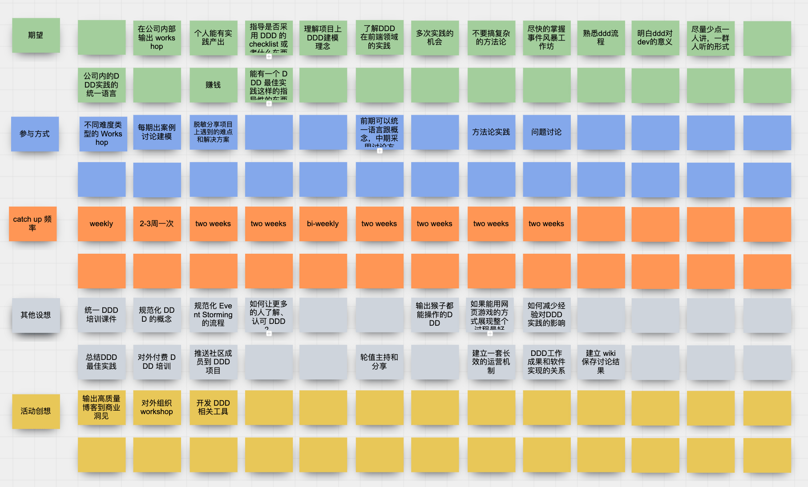
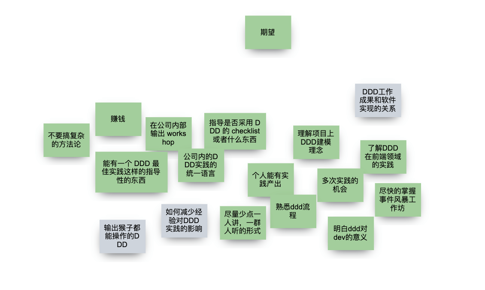
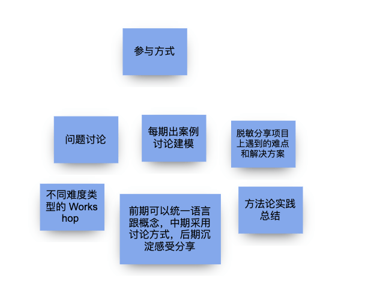
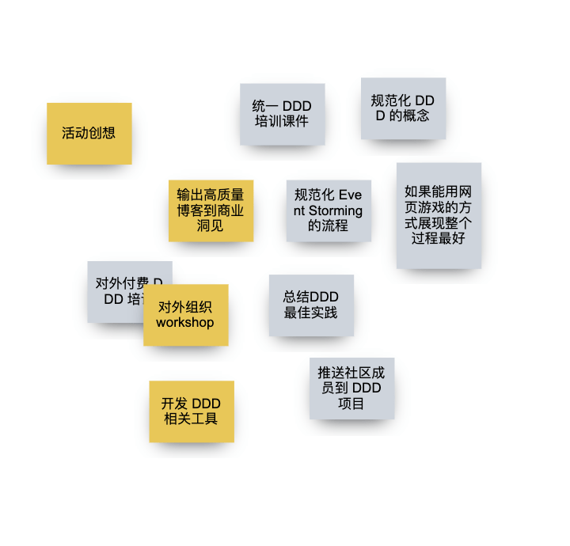
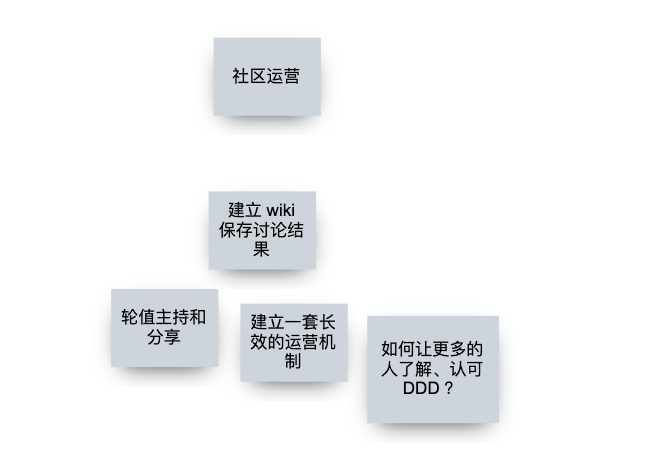
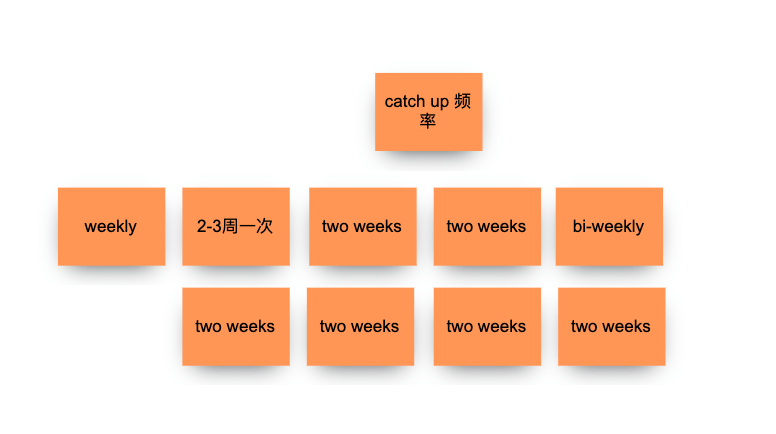
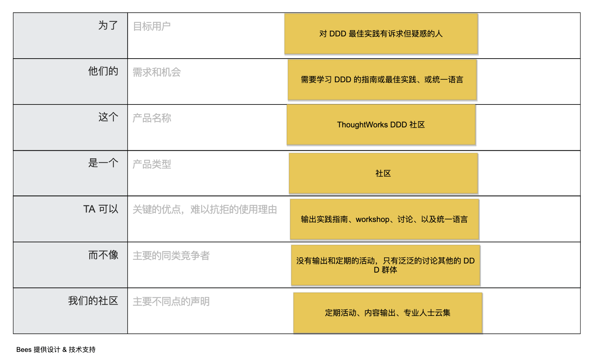

## 您是否对 DDD 充满疑惑？

大家都说 DDD 好，DDD 怎么好呢，我怎么用起来各种问题？

DDD 的原则中要求开发和业务统一语言，但是 DDD 复杂的概念我们自己怎么没能统一？

DDD 到底怎么在项目中实践？

Event Storming 有没有参考指南？

……

我们带着这些疑问成立了一个 base 成都的小社区，只想做一点小小的事情的 —— 统一下 DDD 的语言，实事求是的用 DDD 改进软件设计实践。学习过 DDD 的同事可能都有这些疑惑，所以加入这个社群的人越来越多，有来自一线交付的 MU、咨询等同事，于是决定社区面向全国开放。

为了更好的运营社区，我们组织了一次 kick off，在线上大家首次见面。

## 通过线上协作软件，我们进行了头脑风暴，收集了大家对社区的想法

## 大家的想法非常活跃，有非常多的金点子

### 这是小伙伴对社区的期望

### 以及如何参与和贡献到社区

### 对我们的活动创想

### 规划社区运营策略

### 约定例会频率，避免过多占用大家时间

## 为了让社区定位明确，我们做了电梯演讲

## 如果你对 ThoughtWorks DDD 社区有兴趣，可以扫描二维码加入我们

## 错过了 kickoff 也没关系，我们有录屏

https://thoughtworks.zoom.us/rec/share/kkA7Z5R3MGGaNsEH3i9oRD4MhmQnvTJS_3NohQOgUMEKBlLZecxNQf5GPHVbZEfs.tRHhJVVQhtdU_Ipz Passcode: F!.&C8en

## 特别鸣谢

- ThoughtWorks 社区运营团队
- Bees 团队赞助的 BeeArt 协作软件团队版 https://beeart.hello-bees.com/
