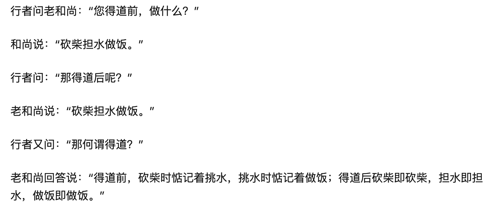

## 2021.01

### 2021.01.03

主要清单

- 协作方案汇总

### 2021.01.04

主要清单

- 买游戏的书籍 done
- 协作方案汇总 done
- 阅读 https://docs.convergence.io/guide/ 
- 写书 1 
- 发出 TL model  done 
- revert 代码 done


### 2021.01.05

主要清单

- 阅读 https://docs.convergence.io/guide/ 
- 写书 1

告诫清单

- 完整的使用英语工作和学习


会议准备：

```
## poc 计划和检查点

1. 准备设计文档（业务、技术），例如功能清单和业务描述、架构图、API 列表、集成说明书草稿等。发送给 CMB 对接人（胡国勇），同步开始我方工作，也可同步邀请外部架构师评审方案。
2. 从 beeart 剥离现有业务实现（画布前端、MQTT、business）（基于 Event 结构化前的逻辑）
3. 实现集成 API和简单的集成 example，example 模拟 CMB 的业务场景
4. 部署 POC 测试环境，包括压测，得出测试结论
5. 分支上尝试 event 结构化和其他网络通信方式。nice to have。（PS：poc 后，包袱较少可以快速验证和调整）
6. 执行 4，评估那个版本更合适给交付
7. 启动对接事宜


## poc 后续工作
1. 启动白板插件化的业务梳理
2. 评估 poc 交付物能否适用于白板插件化
3. 如果不能，设计改造方案
4. 如果 POC 中 event 结构化和通信方式被优化，设计 BeeArt 的改造方案
```


### 2021.01.07

主要清单

- 技术方案 done
- POC 方案 
- MQTT 邮件 TODO
- 周六 standby done 
- 技术卡估点 done

### 2021.01.08

主要清单

- POC 方案 done
- 写书
- Domain-driven-design

告诫清单

- 别做其他人的事情

下周的工作

- 交接 deveops 工作

### 2021.01.10

主要清单

- 看房

告诫清单

- 健康很重要
- 情商很重要

### 2021.01.11

主要清单

- 拉分支
- deveops track 卡，output，运维手册
- 协调提前还贷
- 要是第一

告诫清单

- 健康比房子、车子、美女
- 修德比所有努力都重要
- 每天打磨之前的 summary 学习


手上的工作

- 


免疫力提升

- 营养
  - 早餐：稀饭+白鸡蛋
  - 午餐：正常吃饭
  - 晚餐：面条或正常吃饭
  - 宵夜：面包或水果
- 运动
  - 徒步 + 家庭力量训练
  - 靠墙站立：10mins，促进气血运行
- 睡眠
  - R90 睡眠法，23:00 - 5:00，中午 30 mins 午休
  - 早起冥想
- 保健品
  - 适当吃一些保健品没问题，比如 DHA、复合维生素、葡萄籽等
- 情绪
  - 别憋着，该怼就怼
  - 阅读《庄子》
- 抗炎
  - 每天三次刷牙
  - 多喝水、喝茶


### 2021.01.12

主要清单

- 聊  MQTT done
- 买保健品 done
- 中意人寿材料更新
- 代码清理

告诫清单

- 投资之前，要能做到安身立命
- 模仿是最好的学习方式
- 理性看待别人对你的评价，注意高帽子效应
- 投资如果不够从容，就不是投资，而是赌博


### 2021.01.13

主要清单

- 聊  MQTT done
- 

 告诫清单

- 故意做自己难受的事情，练习自己的执行力
- 当你开始炫耀才华时，才华便一文不值


### 2021.01.14

主要清单

- 中意人寿材料更新

火炉清单

- 《如何做好敏捷的技术预研 (spike)》

 告诫清单

- 模仿是最好的老师，想做的事情先从模仿开始
- 决定价值的不是技术，而是商业，去有商业价值的地方做技术
- 刻意让自己痛苦，可以磨炼自己


### 2021.01.15


主要清单

- CMB update
- 写书

告诫清单

- 灵活应用情绪
- 聚焦手上的工作
- 不做就不会错


### 2021.01.17

- 写书
- bee-graph

告诫清单

- 对自己要有极高的要求，不能敷衍，做任何事情
- 习惯很重要


### 2021.01.18 

- bee-graph
- 可以发火，坚决不批评别人
- 不能不懂装懂
- 


### 2021.01.19

主要清单

- 《如何做好敏捷技术预研（Spike）》 done
- CR 分下剩余的工作 done
- Error Code done
- 图片 API   TODO 

告诫清单

- 道德经中没有道德，所以不需要和普通人说明
- 不和每个人生气，要控制情绪
- 不和领导杠，这样可以躲雨，然后做自己的事情
- 和钱离的很近
- 做资本个附庸，进而成为资本，现有的规则如此，需要顺应规则
- 把小事做好，才能做好大点的事情
- 不要理想主义，要能落地，思考所有的事情是否能赚钱


### 2021.01.20

主要清单

- 单元测试 done 
- 权限控制 todo

火炉清单

- 《短连接设计》
- 《DDD 的存储如何实现？》
- 个人介绍  done
- 
- 和 admin 聊 done 
- 李想的 feedback done 

告诫清单

- 做事情要贴合社会规则，再凌驾于规则，比如证书
- 完成清单后结束工作
- 日常可以拍一些图，作为文章配图使用
- **不要无价值的怼人**
- 想成为一名自由培训师
  - 学历镀金

公众号菜单规划

- 内容
  - DDD 建模
  - 架构设计
  - 团队工作
- 作者
  - 成长心得
  - 服务

技术例会 actions

 - UAT 和上线卡更新 @俊哥 确认 code frezee 时间，来不及的卡做剥离
 - oncall @team 上线 owner、hotfix owner、on call owner 为同一组人，oncall 可以算加班
 - 弱网提示的技术方案优化 @jianlun 组织 review 代码 @H 尝试复现问题  
 - bug 分析和 assign @jianlun 分下类
 - 更新技术卡 《前端配置优化》方案 @林宁


李想的 feedback

- 对技术有热情，主动接手比较困难的工作，比如接手 MQTT 工作，并和后面的同事分享。除此之外，接手了大量的 BeeArt 的一些 spike 工作。
- 能主动跨团队沟通，比如 BeeArt 和 BeeAuth 还是一个团队时，提出Auth 提供一个测试工具套件给 Business 或其他调用者，比推动方案细节，在技术例会讨论，虽然最后没有做，但也有一定意义。

个人介绍 

姓名：林宁

Title: ThoughtWorks 高级咨询师/Tech Lead

个人介绍:

ThoughtWorks 资深软件工程师、咨询师，目前在某在线协作绘图软件工作，研究方向为在线实时协作技术。

长期从事国内外企业软件开发，熟悉敏捷实践，专注于 java EE、领域驱动设计，并为国内多家大型企业提供领域驱动设计和软件建模咨询和培训服务。


### 2021.01.21

主要清单

- 《DDD 的存储如何实现？》 done
- 协作方案和约李新
- 权限控制
- 估点 review  done 
- 《我对模型的思考》


### 2021.01.22

主要清单

- 修复 UAT done  
- swagger 
- 删除接口 done
- 协作方案和约李新 30mins done
- 《bugbush》 30mins
- 支持两种连接方式（MQTT 和 socket IO）


火炉清单

- 《DDD 模型的表达》


告诫清单

- 仔细，周全才能确保问题
- 任何事情要能独立去做，而不是依赖


### 2021.01.23

主要清单

- bug bash 
- 《DDD 模型的表达》


### 2021.01.25

主要清单

- HiveMQ embed
- 更新集成文档
- 报销


告诫

- 战略性懒惰，不去克服自己的性格弱点
- 胆子小，不敢去竞争和斗
- 不要拖延
- 成年人的每一个选择都买定离手了
- 对信息的敏感不够


### 2021.01.26

主要清单

- 对接文档
- 权限优化
- TTL 优化

告诫

- 写合同的时候需要落实


### 2021.01.27

主要清单

- 权限枚举
- 权限 done
- 错误码 
- 文档更新
- 报销


告诫

- 不要拖延，要付出十倍的代价
- 执行力很重要
- 心性的训练很重要


### 2021.01.28


主要清单

- Hivemq config  done
- embed hivemq done
- 权限 done
- 文档更新
- 弱网提示的技术方案优化 done


### 2021.01.28


主要清单

- 文档更新
- keynote
- 《一次应用海姆立克急救法的真实经历》 done
- 回调地址
- Bean validation

告诫

- 要多听取别人的建议


POC actions:

- 晗哥，沟通组织 showcase 和 QA assign
- jianlun & 林宁后续的对接需求（过期跳转）
- 梦兰 UI 反馈


## 2021.02

### 2021.02.01

主要清单

- POC 工作 done
  - 曾加一个 API
- 购房材料 done


过户材料

- 稳定就业证明
- 单位营业执照复印件
- 身份证
- 户口本
- 结婚证
- 成都银行卡原件
- 社保明细


### 2021.02.02


主要清单

- 开源表单 todo
- 发票寄出 done
- 邮件那个问题

- 《团队琐事：release、hotfix 和 oncall》 done


### 2021.02.03

主要清单

- 更新 POC 文档
- 图数据库 spike 

火炉清单

- 《DDD的模型表达》 


### 2021.02.04

主要清单

- 更新 POC 文档 done
- convergence spike 

火炉清单

- 《DDD的模型表达》 done

告诫清单

- 有些东西需要永远记在脑子中

### 2021.02.05

主要清单

- mergechanges spike 
- 优化 graph server 临时存储 done

火炉清单

- 《做软件为什么需要建模?》
- 《DDD 概念梳理》
- wiki 加公众号二维码 done 
- Timecard  done
- 打理博客，使用博客的文章来发布（连接），开通少个分号的域名


### 2021.02.06

主要清单

- 《敏捷迭代日历》 done
- 《DDD 的基本概念和理解》 done

火炉清单

- 优化文章标题颜色 done
- 打理博客，使用博客的文章来发布（连接），开通少个分号的域名
- 发送 docker 镜像 done


### 2021.02.07


主要清单

- bug 分类，组织后端 pick 前端 bugs


### 2021.02.08

主要清单

- 安全自查表 done
- POC event load rest 化
- 去掉了 APM


火炉清单

- 《Event Storming 操作指南》
- 《有节奏感的工作》
- 《复用有度》 
- 《安全自查表》


### 2021.02.09

主要清单

- POC event load rest 化
- ~~去掉 APM done  done~~
- ~~callback 的返回~~ 
- 缩短 graph ID （6-8 位随机数） done
- 姝姝的第二次 interview++ 
- 安全自查建卡 


火炉清单

- 优化图片空间

- 《Event Storming 操作指南》
- 《有节奏感的工作》
- 《复用有度》 
- 《安全自查表》


### 2021.02.10

主要清单

- Bee-design 修复  done
- 安全自查建卡  done


火炉清单

- 优化图片空间

- 《写给开发看的测试知识》


### 2021.02.13

- 姝姝的第二次 interview++ 
- 《实践论和矛盾论》


### 2021.02.14

- 公号文章选择 done
- 姝姝的第二次 interview++   done
- 自测 POC 工作
  - 图片空间问题处理 done
  - 统一 Autowired 方式 done 
  - appId 命名问题 done
  - snapshot 问题，前端没有实现 Snapchat 问题
  - 清理无用的代码  done
  - clean prometheus done 
  - 仓库路径 done
  - findbugs done
  - hivemq version done
  - swagger 问题 to test
  - 输入校验问题 done
  - add some logs
- 精力问题分析


姝姝的第二次 interview++  


Well

- 工作积极认真，会按照 retro 的 action 认真执行，比如 retro 中建议给每个故事卡编写测试用例用于开发自测，确实有坚持在做。
- 能力独立完成重要的测试任务。比如组织 UAT Bug Bash、上线后的验收测试等场景。

suggestion

- 希望更自信，来团队时间晚，不代表不能发出自己的声音，如果自己认为正确的事情应该坚持。

告诫清单

- 做形势分析，购买部分个股

### 2021.02.16

主要清单

- 精力问题分析 done
- 写书 开启下一章 done 


### 2021.02.17

主要清单

- 键盘托 done  没用
- 文档 review 以及发布到 graph-server 中  done ，明早更新
- graph-server 问题自查 done
- 第三方依赖处理
- 免疫力提高问题搜索  done

告诫清单

- 公号发之前，要先阅读一遍
- 可以翻译 DDD 的一些文章，顺便学习英语


### 2021.02.18 

主要清单

- 调整 pod 配置  done
- 验证 tmp 目录大小是否够用，压测中的各种指标
- 性能优化
- helm 部署脚本
- 填工作量估算 done 
  - https://docs.google.com/spreadsheets/d/1filyZZaBNUOH84mbh7bjCBXUGUnrI8m3SCg1Z_Mt24w/edit?usp=sharing
- 给建伦反馈 2 个问题
  - rest化 event
  - 快照
- Rest 化 load event

### 2021.02.19 

主要清单

- rest化 event done
- tool bar 问题 done 
- helm 部署脚本，不必用 helm 部署
- 工作量评估 done
- 错误信息被广播的问题 done
- 断网后恢复重新获取数据 待验证 done
- 回复 CMB 入场时间 done 
- mq 改为内存化，调低过期时间 done
- 性能优化加载速度，等 rest 化后来做


火炉清单

- 技术雷达 https://docs.google.com/spreadsheets/d/1RetYSEQSSTldmkp9Pey-Ey1Jn-k0zXLKkNsJY5Hp0nQ/edit#gid=1777330470 done
- 验证 tmp 目录大小是否够用，压测中的各种指标 done

告诫清单

- 任何时候保持冷静是最重要的事情
- 休息的时候可以和朋友聊天
- 目标感，2021 唯一一件事写书
- nice to have: 学算法
- 这个世界没有谁是傻子


### 2021.02.20

主要清单

- 修 bug
- 上线 owner   done 
- 周一的技术方案同步给团队 TODO 

火炉清单

- 《Monolith first》翻译工作
- 《尝试给微服务下个定义》

告诫清单

- 多做多错，只做自己范围工作
- 当你觉得完美的时候，一定有问题
- 当你占便宜的时候一定有陷阱


###  2021.02.21

主要清单

- 把团队文档转文章清单
- 《谈谈投资》done


### 2021.02.22

主要清单

- CMB 部署
- 《理解 DDD：编程中的模型思维》公号
- 梳理文章在 trello 中的 tack
- UI 卡片


### 2021.02.23

反思清单

- 认知局限依然存在，谦虚和不绝对多么重要
- 很多错误无法避免，既来之则安之
- 不会换位思考
- 说话太绝对了
- 知识量不够，有大量的关于买房的书籍，没有买来看，导致买错朝向
- 决策时间太短，没有使用决策方法（不后悔原则 40s 4个月 4 年），你失去了什么
- 大脑不够清晰（鼻窦炎需要继续治疗）
- 最终决策的时候没有再征求朋友意见

- 陷阱无处不在
- 总是后知后觉，需要辩证的从反面思考
- 需要更冷静，不要说太多的话
- 看的次数太少（至少 3 次）
- 功课不够
- 福兮祸兮，不用太紧张
- 事情的优先级不分，买房子是一件大事，应该排在前面
- 如何安慰自己和避免下次的错误
- 很多东西不随主流，这样不好，不去了解

主要清单

- 社区人员
- 预约医院
- 《决策模型》
- 看房手册


### 2021.02.24

- 社区人员 done
- 额窦炎的 done
- mbp 的图 done 
- 房子图 done

 

### 2021.02.25

主要清单

- 业务卡
- news letter
- 对买房的反思
- event batch merge


告诫清单

- 心要静，我其实还是没有做到（在何佳哪里的时候），虽然自己认识到了这点，但是还是做不到
- 保持开放
- 积极治疗鼻窦炎
- 不要在试图说服任何一个人
- 这次买房作为一个教训来看待
- 看清价值而不是价格
- 每一个点都有它背后的原因需要分析
- 如果这次没有吸取教训就毫无意义，置换一套双流朝南的房子


### 2021.02.26

主要清单

- 发送域名出售邮件

告诫清单

- 任何决定留有一点余地
- 考虑好正反两个方面，可进可退，把决定权留在自己手上，就不会忧虑
- 找一个理由


### 2021.02.26

主要清单

1. 发送邮件 done
2. 反思买房 done
3. 业务卡
4. POC 剩余的事项 


Hi 展文，

周末好，本周白板 POC 集成已经启动，工作成果和问题如下：

1. 白板的前后端服务都已经部署到行内自建容器云平台的 ST 环境
2. 修复了一些联调过程中发现的问题
3. 解决了和招行容器云融合的各种问题（配置不生效、镜像不支持、数据库访问缓慢、网络规则限制等）


以下是下周集成工作目标

尚需解决(目前已知)的问题：

1. 日志配置
2. 多实例运行

来自业务的额外需求：

1. 需要只读链接功能 —— 提供一个开放的白板查看能力（不同于查看者，匿名用户也可以访问）。这部分工作待细化具体业务逻辑，以及评估工作量（大概数天时间），需要和同步 BeeArt 团队再考虑开始。

最后感谢招行对接的同事国勇的配合，合作非常默契，如果有任何疑问请保持沟通，谢谢！


### 2021.02.27

主要清单

1. 业务卡 done
2. POC 剩余的事项 done 
3. 写书

告诫清单

1. 要想别人尊重你，需要对自己的要求极高，少评论


## 2021.03


### 2021.03.01

主要清单

1. event 结构化批量 merge done
2. 修复 CMB bug
3. 多实例 todo
4. 社区安排 done 


告诫清单

- 投资就是心性的修炼，心性磨平之后才能开始赚钱
- 投资就是在价值低估的时候买入，然后交给时间，耐心的等待低估的机会，耐心等待周期性的波动，在合适的时机操作


### 2021.03.02

主要清单

1. 徒步报名 林如凯 513027194910031617 done
2. CMB 问题反馈建卡 done
3. CMB 问题反馈处理 done
4. CMB 只读连接结论回复 


火炉清单

2. 《我的决策模型》 
3. 《芒格思维》 
5. 选择一个债券基金 done 


### 2021.03.03

主要清单

1. 部署 merge-changes 到 dev done
2. CMB内部多实例处理 
3. 给同事带东西 done
4. 抵押 done 
5. 技术例会 done 
6. DDD 文章整理（表格） 
7. 太保的文章 trello 更新


火炉清单

- 写书和文章


多实例的问题处理策略

1. mq 和业务服务隔离
2. 使用 socket io + redis 做数据隔离


告诫清单

1. 不要给人讲道理，用结论说话
2. 可以影响其他人给你干活，不要去试图改变别人的思想，任何一个人
3. 努力培养决策思维和逆向思维
4. 做网络编程这部分作为技术基础，学习方向就是 linux、jdk、netty
5. 不做大数据、AI
6. 不懂技术的老板比较麻烦
7. 让自己配得上对象和工作
8. **merge changes 和协作通信是 beeart 的核心问题**
9. 聚焦核心问题

### 2021.03.04

主要清单

1. CMB内部多实例处理 done
2. 使用 socket io + redis 做新的协作方案，支持水平扩展 <<<<<<<<<<<<<<< 


火炉清单

1. 技术架构文档
2. 周年 100 元报销
3. **购买一本 netty 的书籍** 《**Netty、Redis、Zookeeper高并发实战**》
4. 写一篇 bees 软文《我在 Bees 团队学到的》  done
   1. 技术实践：微服务、计算机网络、
   2. 软的东西：实事求是的分析方法

告诫清单

1. 学习计算机网络和 java 网络编程
2. bees 的核心是在线协作画图，这部分技术需要细细掌握(netty)


### 2021.03.05

主要清单

1. 使用 socket io + redis 做新的协作方案，支持水平扩展 <<<<<<<<<<<<<<< 

2. 写书第二章

   

火炉清单

1. 技术架构文档
2. 《芒格思维》 读完芒格的书


### 2021.03.08


主要清单

1. 发送邮件汇报集成工作 done
2. 测试脚本  done 
3. 安全问题处理 done
4. POC 测试计划 done 
5. beeart 运行数据拍照
6. 使用 socket io + redis 做新的协作方案，支持水平扩展 <<<<<<<<<<<<<<< 
7. 定提醒周四评估 POC上线 事宜 done 
8. 讨论附件 clone 的问题 done
9. 挂号 done 
10. 约收房时间 done
11. 全局拦截器的技术卡讨论 todo 
12.  java 来给时间问题处理 done 
13. 梳理事件流转图


火炉清单

1. 技术架构文档
2. 写书第二章
3. 《芒格思维》 读完芒格的书
4. 修复 CR 问题 done


告诫清单

1. 不要提交无用的内容
2. 做事情要清晰明白，尊重墨菲定律 


Hi 展文，

上周白板 POC 集成已经大部分工作，解决了集成过程中的问题：

1. 日志配置
2. 多实例运行（由于私有容器云使用了异地多活，无法使用 URL 的方式对有状态的系统负载均衡，和招行同事讨论后，我们用虚拟机部署了用于协作的 MQ 服务，在容器云部署了应用服务）

另有更新：

1. 只读链接功能，因为在业务上会带了逻辑问题，暂时不上

以下是本周集成工作目标

1. 配合 QA 同事根据行内的环境做下压测，计算出未来需要的资源

如果有任何疑问请保持沟通，谢谢！


### 2021.03.09

主要清单

1. 业务卡  done 
2. 安全代码 pick done 
3. 和刘航沟通是否愿意来做前端
4. event 结构化版本问题 done
5. 使用 socket io + redis 做新的协作方案，支持水平扩展 <<<<<<<<<<<<<<< 
6. ux 的一个问题
7. 预约牙医

火炉清单

1. 技术架构文档
2. 计划提取公积金


告诫清单

1. follow 
2. 不要有意见
3. 不要有情绪
4. 不要老是垂头丧气
5. 不要做一个太 nice 的人
6. 不要把自己的想法过早的暴露，做出来了再说
7. 自由其实就是选择的权利
8. 踏踏实实
9. 收缩，不碰前端问题


### 2021.03.10


主要清单

1. 和刘航沟通是否愿意来做前端
2. 使用 socket io + redis 做新的协作方案，支持水平扩展 <<<<<<<<<<<<<<< 
3. ux 的一个问题
4. 预约牙医
5. 错误会互相影响的bug 验证，没有这个问题不用担心 done 

火炉清单

1. 技术架构文档
2. 计划提取公积金


### 2021.03.11

主要清单

1. 业务卡

火炉清单

1. 社区邮件组
2. 技术架构文档
3. 计划提取公积金


### 2021.03.12

主要清单

1. 调试 socket io done 

火炉清单

1. 社区邮件组
2. 计划提取公积金


### 2021.03.13

主要清单

1. 收房
2. 社区邮件组
3. 计划提取公积金


### 2021.03.14

主要清单

1. 写书第 2 章
   1. checkstyle <<< 
2. 清理生活中不必要的东西 done 


告诫清单

1. 能抵御无聊的人都比较牛逼
2. 把人物分解到能简单完成的程度就可以写完一本书

 

### 2021.03.14


主要清单

1. 更新 POC 为 Event 结构化版本
2. 业务卡


火炉清单

1. 社区邮件组

2. 计划提取公积金

   

### 2021.03.16

主要清单

1. 计划提取公积金 done 
2. 预约发货电脑 done 
3. 发货闲鱼 TODO
4. DDD 演讲话题报名


公积金材料

1. 房产证
2. 贷款合同   <<< 我们还没拿到
3. 契税票
4. 结婚证
5. 身份证复印件

两个账户需要两套材料


### 2021.03.18 

火炉清单

1. 社区邮件组
2. 邮件 to china 
3. 添加卡片慢 
4. 去苹果 done 
5. 发货 done 


告诫清单

- Mac 卖了，应该多比较一下，意识这是一个决定，然后执行决定前的分析过程


### 2021.03.19 

主要清单

1. 邮件 to china  done 

2. 技术 session 报名表 done

3. catch up 准备 done

4. 定 catch up 时间  done

6. 社区邮件组 done

### 2021.03.20 

   

主要清单

1. 添加卡片慢 
2. 写书


### 2021.03.21

   

主要清单

1. 分析添加卡片慢 API  done 
2. 写书 
3. timecard done 
4. 去车里拿支架 done
5. DDD 讨论 done


### 2021.03.22

主要清单

1. 写书


### 2021.03.23

主要清单

1. 文本icon 业务卡 done 
2. 排列业务卡 <<<<<
3. review PR
4. tab 连接问题
5. PT MQTT 问题

火炉清单

1. 写书，codereview 部分
2. DDD 社区下次活动计划


### 2021.03.24

主要清单

1. 性能优化 done 
2. 连接问题
3. 学习一下 rxjs


火炉清单

1. 写书
2. bug 处理流程


告诫清单

1. 分清主次
2. 和自己无关的事情不要关心
3. 有可能发生的问题，最终都会发现
4. 禁止批评


性能优化

1. 测试方式
2. 性能指标
   1. 同一项目 50 人
   2. 2s 内返回
3. 优化方案
4. 截止时间


### 2021.03.24


主要清单

1. 清理 POC 卡 done 
2. 留资 API done
3. tab 休眠
4. 性能优化 PART2
5. 社区仓库


提示断网逻辑

1. 只有有一个 ping 包不回来就会触发断连，这是不对的。1135 
2. 如果一个 ping 包没回来就会判定为断网
3. 导入和图片上传为啥会触发断网，说明断网判定有问题？
4. 使用中断网、tab 休眠断网、丢数据、性能低下是不同的问题
5. 前端日志有问题
6. 重连和提示断网的逻辑不对
7. 用 socket io 试试连接断不断


解决方案

1. rest 不应在断网逻辑中
2. tab 休眠问题处理
   1. 休眠的时候可能收不到 ping response，导致重复连接
   2. 优化 ping 包的逻辑
3. 长期来看 MQTT 不适合，即使使用 MQTT需要把用户的连接按照 url 分布到特定的服务器上，防止干扰
4. 需要限制画布大小
5. 无论是否 Event 结构化都需要消息幂等
6. 没人用的时候就不会出问题，本质原因还是性能


```java
this.mqttAgent.client._checkPing = function () {
  console.log("send ping")
  if (this.pingResp) {
    this.pingResp = false
    this._sendPacket({ cmd: 'pingreq' })
  } else {
    this._cleanUp(true)
  }
}

this.mqttAgent.client._handlePingresp = function () {
  console.log("_handlePingresp")

  this.pingResp = true
}
```


### 2021.03.25


主要清单

1. specification
2. POC MongoDB 版本 done 


### 2021.03.27

主要清单

1. tab 休眠问题 done 
2. beegrpah 组织测试 done 
3. specification
4. 写文章


### 2021.03.28 

主要清单

1. 文章 codereview 指南
2. 技术卡估点


1. 


### 2021.03.29

主要清单

1. 报告梦兰的 bug 和 录屏 done 
2. 修复共享订阅后再压测 
3. socket io demo  done
4. 使用 emqx 的集群 最安全的现有方案 done 
5. 使用 socket IO done
6. 发社区 calender 《那些年在客户DDD工作坊现场遇到的坑》 done 


火炉清单

1. 文章，事件风暴指南。（闭环逻辑，电梯演讲 -> 子域划分 -> 事件风暴-> 命令风暴 -> 模型识别 -> 上下文划分 -> 模型展开 -> 模型评审 ）


告诫清单

1. 任何想法要足够具体


MQTT 相关资料

1. https://zhuanlan.zhihu.com/p/148734253
2. https://docs.emqx.cn/enterprise/v4.2/development/java.html#paho-java-%E4%BD%BF%E7%94%A8%E7%A4%BA%E4%BE%8B


### 2021.03.29

主要清单

1. specification  done
2. emqx  + 共享订阅 
   1. 清理代码 done 
   2. 测试一下是否同步支持 HiveMQ
   3. userId 伪造问题处理
   4. 兼容 HiveMQ 避免多个服务
3. clean 属性 done 
4. 技术卡的业务点 done 
5. 技术分享 《Tab 休眠问题解决和 mqtt.js》 done
6. 文章用于点评 done 


火炉清单

1. 文章，事件风暴指南。（闭环逻辑，电梯演讲 -> 子域划分 -> 事件风暴-> 命令风暴 -> 模型识别 -> 上下文划分 -> 模型展开 -> 模型评审 ）


### 2021.03.31

主要清单

1.  前端业务卡 bugfix  done

2. ws poc 多机 done 

3. emqx  + 共享订阅 

   1. 清理代码 done 
   2. 测试一下是否同步支持 HiveMQ
   3. userId 伪造问题处理
   4. 兼容 HiveMQ 避免多个服务
   5. 修复订阅相关的业务问题 done

4. 技术卡

   1. 有些 event 不需要 save TODO 

5. 限流问题 done

   

告诫清单

1. 本来应该不说话的，还是多说了话


火炉清单

1. 文章，事件风暴指南。（闭环逻辑，电梯演讲 -> 子域划分 -> 事件风暴-> 命令风暴 -> 模型识别 -> 上下文划分 -> 模型展开 -> 模型评审 ）


Pt 环境改动

1. /mqtt-socket/ 改动
2. 前后端代码部署
3. mq 指向 mqtt.server.host
4. url rewrite


## 2021.04

###  2021.04.01


主要清单

1. Event save 的技术卡 done
2. 压测  done 
3. merge issue，组织再测试
4. 晚上 critica l done 
5. 拉了分支后开始做后端的重构 done 


火炉清单

1. 四月对外活动的策划，找大顾问约时间 done
2. 定社区下次个活动时间和主题，下周三晚 9 点 done 
3. 给文辉老师买礼物的事情 done
4. specification done
5. 徒步报名 done
6. https://drive.google.com/drive/folders/1-O8queQi1_el-so3cyuHJJ6DCEtVSl6Z?usp=sharing  done
7. 充话费 <<< done 
8. 还贷计划 done 


### 2021.04.02


主要清单

1. 连接数限制问题 
2. 服务器超时 无法复现，先不处理了


火炉清单

1. 2021 期望  todo  TODO 
2. 整理公积金材料 TODO，等找到卡再说 done 
3. 下周三的社区活动 done 
4. Event Merge 问题，测试失败需要继续修复 done 
5. 时间风暴工作坊 <<<<<


告诫清单

1. 聚焦，不参加无意义的会议


2021 期望  todo 


1. BeeArt 架构治理和重构，是其能继续演进
2. BeeArt 性能和容量提高到 500 人同时在线，2s 内协作超时
3. Bee Graph 响应客户需求，改进方案和实现
4. DDD 社区做一次对外活动


2021.04.03


主要清单

1. 写书的第第三章
   1. 图片梳理，使用章节图片定位
   2. 升级代码到 junit5


火炉清单

1. 公积金材料
2. 取消租房 done


### 2021.04.06

主要清单

1. 一张技术卡 <<<<<<<< done 
2. 后端简单代码清理 done
3. 重构
   1. 维护模型图 done 

火炉清单

1. 合并specification  done 
2. 报销发票准备 done
3. 事件风暴指南 <<<<< doing 
4. 
5. 公积金材料 done 
6. review 和期望，晚上做 done 


告诫清单

1. 重构，做到哪里就改哪里


公积金材料

1. 房产证
2. 贷款合同   
3. 契税票
4. 结婚证
5. 身份证复印件

两个账户需要两套材料


### 2021.04.07

主要清单

1. 图片重构 
2. 修复 CI done 

火炉清单

1. 事件风暴指南，可视化输出示例
2. 后端招人 done
3. 谈期望 done 
4. **做一套好的 java 小脚手架*

告诫清单

1. 严格 codereview，把小问题弄明白
2. 这个迭代能把重构做的差不多
3. 还没做到的事情先不把牛吹出去，即使吹出去也无所谓
4. 不要显得很聪明，保持绝对理性
5. 禁止批评别人，教别人做事，抱怨，少说话
6. 不要做太多的事情，做好手上的事情即可
7. **回归高级 java 软件工程师职责本身，关注自己的事情不做其他的事情**
8. 做了咨询真的不会写代码了，还是写代码具体，可以偶尔去做下咨询
9. 我是好的将，但不是好
10. 不要轻易下结论


### 2021.04.08

主要清单

1. 图片重构  done 
   1. 先记录一个基本的表
2. 公积金 done

火炉清单

1. 主体客体

告诫清单

1. 在打工时期，忠诚比能力更好，可以更悠闲保存实力
2. 《权限模型就是用例模型》
3. 《做产品的原型思维》
4. 注意自己的情绪


### 2021.04.08

主要清单

1. 图片重构
   1. 先记录一个基本的表
   2. url 的处理  
2. 技术卡 done
3. 性能压测 done 
4. 公积金 for UU

火炉清单

1. 社区杂事
   1. 社区定 calender
2. 主体客体

告诫清单

1. 在打工时期，忠诚比能力更好，可以更悠闲保存实力
2. 《权限模型就是用例模型》
3. 《做产品的原型思维》
4. 注意自己的情绪


### 2021.04.10

主要清单

1. 文章：《面向对象的主体客体思维》 done 


### 2021.04.11

主要清单

1. 授权书和身份证 done 
2. 预约我爸的医生 done
   1. 周一中午去搞公积金 done 
   2. 取报告时间定了再约号 done
3. 演讲的技术整理 done 
4. 写书
   1. 升级 junit5，用一章 《Junit 5 新特性》 done 

告诫清单

1. 随时保持清醒，虽然很难但是不得不这么做
2. 公号文章可以持续写，每次不超过  1500 字
3. 每天晚上花 30mins 来做 SACC 的演讲
4. 把自己的打字速度提高到和自己的思维的速度，可以让自己的更加敏捷。
5. mac 语音输入工具可以帮助我们更为流利的思考。
6. 做事情要足够具体，不然现在一件拿的出去说的事情都没有
7. 要足够聚焦，如果打字慢，会导致思考的时候会打断思考方式
8. **写作就是把别人的东西变成自己的，所以需要大量练习阅读理解。**





### 2021.04.12

主要清单

1. 技术卡
   1. 部署一下 emqx 
   2. emqx  权限控制
   3. 重构 Entity 表
2. catch up 
3. 后端人员回复


火炉清单

1. 分析 spread js 协作 demo 
2. 主客体 PPT 


告诫清单

1. 不要给自己加太多东西，需要聚焦，现在聚焦的就是《Java 自测这部分》
2. 身体很重要，认识到自己的能力边界


### 2021.04.13

主要清单

1. 公积金 done
2. 用 CI 部署一下 emqx  done 
3. emqx  权限控制配置
   1. userId from token  done 
   2. 服务器 auth done
   3. client auth  done
   4. ACL


### 2021.04.14


主要清单

1. 剩下的技术卡 done
2. 下个迭代的技术卡 done 


火炉清单

1. 《SACC 的分享 PPT 设计》
2. 凯峰的文章 review  done 
3. 《Bug 流程》


### 2021.04.15

1. 给刘航 assign 了一次分享
2. 做一个 JPA demo
3. CI 那个问题，发邮件只能 VPN 内部才能访问 doing 
4. 压测  doing  
5. beeart 跳转 doing 


火炉清单

1. 《SACC 的分享 PPT 设计》 <<<<<<<<
2. 重构最佳实践 done 
3. 测试 emqx auth 问题  done


告诫清单

1. 保持清醒
2. 一次只做一件事
3. 把事情彻底弄明白


### 2021.04.16

主要清单

1. topic 共享订阅策略 done
2. 测试 MqttService done 
3. 压测和优化性能
   1. 加入 emqx 的群
4. 站会提醒下
   1. 看 sonar 的事情 done 
   2. 约测多机事情 done
5. 修 sonar  done
6. 技术文档 done
7. DDD 社区外部活动话题介绍 done 

火炉清单

1. 买入 50ah done


DDD 社区对外话题说明

标题：《DDD 概念参考和解释串讲》

简介：DDD 的原则之一就是统一语言，在 ThoughtWorks DDD 社区，我们对概念达成共识，并整理成了文档作为参考。勿在浮沙筑高台，深刻理解 DDD 的概念是在工作中运用的基本条件。本次分享会通过概念图这一工具，对 DDD 的基本概念和衍生概念进行连接和串讲。

讲师简介：林宁，ThoughtWorks 软件工程师、Teach Lead、咨询师。专注于 Java 分布式系统和中间件的开发、领域驱动设计（DDD）的咨询工作。服务过国内外通信、保险、银行、餐饮等行业的企业，为国内知名企业提供过 DDD 咨询服务。《ThoughtWorks 洞见》公众号的专栏作者。


### 2021.04.17

1. How to recognize bounded context，is there any specific process?
2. I think micro-services should have diffirent role to take diffirent responsibility, and this way can cap layers of DDD to micro-services. But some one else consider them are same.How do you think?
3. How do think congestion model which writing logic in Entity?
4. if that how to isolate the differences from different request, such as from admin  \ normal user  \ open API?


告诫清单

1. 坚持每天都要写作
2. 聚焦，专注当下的力量


### 2021.04.18


主要清单：

1. waring 无问题先监测

2. 断网 done pt 测试无问题

3. 模板性能
4. PPT done
5. PR 
   1. done

1. 课程
   1. 发送邮件给 albot  done 
   2. 图片使用授权？ done
2. demo 
   1. Spring Data 的多对多最佳实践
   2. 写 API 测试相关内容


How to combine data for a list display by acrossing domain service?

How do think congestion model which writing logic in Entity?


火炉清单

1. 资料库
2. 优化数据库查询
3. API 测试文章


告诫清单

1. 话不能太多，保持安静


### 2021.04.19

主要清单：

1. 时候可以上线？ done
2. PR done
   1. https://gitlab.com/tw-gaia/gaia-business/-/merge_requests/82
3. mq 问题
   1. HiveMQ 做到完全兼容，可以用 PT 环境
   2. **验证重连，重连没有成功** done 
   3. 再次检查 topic 清单 done
   4. userIdEmpty issue done 
   5. last will 问题 done 
   6. Hivemq 2.14 版本，merge 回 master 
   7. 挂一晚上后跳转到登录
4. 模板接口 done 


火炉清单

1. 给重构 demo 写单元测试 TODO
2. 洞见文章 review
3. 文章
   1. 前端配置方案
   2. neal 的培训总结
   3. DDD 专栏消息回复
   4. 数据库设计规范
   5. 多对多关系建模
   6. 用例处理过程
   7. 在创新之前先学会模仿

告诫清单

1. 找到自己的生意，越具体越好，现在是做写书


### 2021.04.20

主要清单

1. Hivemq 2.14 版本，merge 回 master 
2. 重构单元测试和重构卡
3. 中信的文档补全

火炉清单

1. API 测试例子


告诫清单

1. 如果没有自己的世界观和哲学基础，就被别人洗来洗去。看到点东西就发现，这也有道理，那也有道理。
2. 注意休息，身体健康是最重要的事情


### 2021.04.21

主要清单

1. 51CTO 合作方案 done
2. CI 自动触发

1. Hivemq 2.14 版本，merge 回 master 
2. 重构单元测试和重构卡
3. 中信的文档补全 done 

火炉清单

1. API 测试例
2. 选号

告诫清单

1. 社区的活动都叫做 “边画边聊” - 在线协作白板互动研讨会，以后在线活动都叫这个名字


### 2021.04.22

主要清单

1. Hivemq 2.14 版本，merge 回 master 

2. 重构卡

   1. 白板
   2. 模板

   

火炉清单

1. API 测试例
2. 选号
3. 51CTO 合作方案时间确定
4. VPN 白名单测试
5. Neal 的课程文章
6. **把 JPA 和缓存搞明白**

告诫清单

1. 模仿是最好的学习
   1. 采用调查的方式
   2. 采用解构的方式来分析目标对象
2. 心理
   1. 谁赢他们帮谁
   2. 激励团队的最好方法不是花钱，而是带他们赢
3. 《让你的任务具有可执行性》
4. 《为什么架构师需要一块白板》
5. 这段时间的工作不够高效，本质是干扰太多造成的


### 2021.04.23

主要清单

1. Hivemq 2.14 版本，merge 回 master 
2. VPN 白名单测试
3. 重构卡
   1. join 优化
   2. 错误码重构
4. 技术卡清单 done
5. 交换工作日的消息 done

火炉清单

1. API 测试例
2. Neal 的课程文章
3. 选号
4. 51CTO 合作方案时间确定
5. **把 JPA 和缓存搞明白**
6. **做一个自己的 CRUD 的例子**

告诫清单

1. 聚焦主要目标
2. jvm 算法，这些为主要问题
3. 保持清醒
4. 专注自己的事情，不要给别人帮忙
5. 花了 5年 认清一件事，代价太大了
6. 不要管别人的事情，边界感很重要
7. 不要说话，不要批评，只要分享，学会 act
8. 以退为进，不要自己去推动，让别人来推动


### 2021.04.24

主要清单

1. Hivemq 2.14 版本，merge 回 master 
2. VPN 白名单测试
3. 前端支持卡
4. 重构
5. 获得所有凭据
6. 人天溢出，任务卡调整安排
   1. 刘航周日私有化部署，需要一个 1 个点左右，周一下午林宁需要去招行 hotfix
   2. 2945 由于默认行距优化，需要更新【通用套件】 。后端需要 0.5 个点左右
   3. 2855-用户通过邀请链接进入白板之后，用户在线状态未刷新。后端支持需要 1 个点左右
   4. 移除迭代： (0/2)tool/template/scenekittool参考案例重构 
   5. nice to have:  (0/1.5)系统参考案例重构
7. 内部资源纳入 VPN 管理


告诫清单


火炉清单


1. 海报反馈 “用户看了可能不知道 BeeArt 是什么，也不知道我们要用协作白板讲 DDD ” 
2. DDD 软件建模


### 2021.04.26


主要清单

1. 重构后的问题处理
2. 异常重构
3. 招行 hotfix done


火炉清单

1. 社区改组方案
2. 《为什么每个工程师都需要一块白板》
3. 《公司对外宣发 review 清单》
   1. 回头找下那次培训的材料，对外内容的注意事项
4. Dhruv Kapur 口罩
5. 各个渠道 QQ、wechat 群转发海报 done 
6. 社区 VI 送审 done
7. 改头像  done


告诫清单

1. 整存整取


### 2021.04.27


主要清单

1. 重构后的问题处理
2. 异常重构
3. 丢数据分析
   1. KK
   2. 招行
4.  寄出快递

告诫清单

1. 不要太为别人考虑，多为自己考虑
2. 聚焦，这几天又失去焦点了，搞得很累
3. 公司的事情按部就班即可，自己的事情自己做主
4. 保持冷静，百折不挠
5. 保持乐观
6. 你必须要承认，一个人能做的事情很少，所以必须聚焦 《聚焦》
7. 保持冷静！


### 2021.04.27


主要清单

1. CR 问题 done 
2. 异常重构 <<<<<<< 
3. 贝尔测评 done
4. 丢数据分析 done
   1. KK done
   2. 招行 done
5. 需求评审
   1. https://lanhuapp.com/web/#/item/project/board/proto/edit/entry?pid=e1f09982-c048-4fb6-a6a8-d9e0b58de9ff&imgId=6c6ae45c-391e-4527-a62f-491dfb9dfa0b&from=img
6.  填写快递 done 


火炉清单

1. neal 的文章 <<<<<<<<<


告诫清单

1. 不要参合太多事情，费力不讨好
2. 聚焦，这几天又失去焦点了，搞得很累，精力被分散了
3. 把后端 TL 做好即可
4. 让自己的事情越来越少
5. 除非对自己有利，少当牵头人
6. 不懂得装糊涂，争强好胜


问题：

1. 群组的邀请成员怎么通过连接邀请？
2. 每个层级的加入逻辑
   1. 加入空间 -> 加入群组 -> 加入项目/白板
   2. 如果被空间移除，原来加入的群组、项目、白板怎么处理
   3. 群组管理的交付为空白
3. 每层的角色
   1. 站点，目前有管理员、普通用户角色
   2. 空间，目前个人可以归属到不同的空间，设有空间管理员、成员，现在需要增加查看者？空间查看者能访问那些资源，能被加入群组吗？
   3. 群组，是否有管理员，成员的概念，群组管理员的权限如何？项目必须要由群组管理员创建吗？一个项目可以属于多个群组吗？
   4. 项目，目前有编辑者、查看着、拥有者权限
4. 个人空间群组成员
5. 群组类型如何定义
   1. 私有群组
6. 付费策略和每层权限之间的关系
   1. 付费策略只能基于正常结构限定，不能有额外的逻辑
7. 资源库归属逻辑，没有绘制
8. 群组移动到其他空间，那么成员怎么处理？
9. 删除群组的逻辑规则
10. 群组内的项目邀请成员是只能在群组成员范围内吗？
11. 群组中包含的是只有项目吗？


### 2021.04.29

主要清单

1. 画布不同步和钱老师一起分析画布不同步问题 
2. 启动重构done
   1. userApplication mock 测试
3. neal 的文章 done 
4. timecard done


火炉清单

1. 《多租户和分级付费模型》
2. 《用 DDD 指导用例和领域分离》
3. 约钟敬老师聊课程的事情


提醒清单

1. 串课程

告诫清单

1. 聚焦，像一颗钉子一样聚焦


火炉清单

1. 《软件建模：多租户和分级付费模型》
2. 《用 DDD 指导用例和领域分离》
3. 约钟敬老师聊课程的事情


### 2021.04.2

主要清单

1. 修测试 done
2. 阅读权限相关原理
   1. 
3. hivemq 合并代码
4. 提交文章
5. 《软件建模：多租户和分级付费模型》
6. 《DDD 分层架构下的测试策略》


火炉清单

1. 《软件建模：多租户和分级付费模型》


提醒清单

1. 报销 done
2. 时候允许直接使用 Repository  done 


## 20201.05

### 2021.05.01

主要清单

1. Specification SEO 优化 30mins done

   1. Keyword 优化
   2. Description 优化

2. DDD 课程准备 done

3. API 测试实践 

   

火炉清单

1. 《恋爱心理分析：合理性大于逻辑性》
2. 《为什么架构师需要一块白板》 完善和发布
3. 《软件建模：多租户和分级付费模型》

告诫清单

1. 完成一件事，比做 10 件事情强 100 倍


### 2021.05.02

主要清单

1. 人际关系：学会制造合理性 done
2. API 测试实践 <<<<<<

火炉清单

1. 搬家


告诫清单

1. 注意自己身心健康和自己的形象，第一印象是能让女人和你上床的重要条件
2. 写一篇 1500 的文章真的不需要太多的时间，将关键的内容即可
3. 保持清醒，然后随心随性即可，不必在乎其他人的看法，除非损失了自己的利益
4. 高级的猎人往往以猎物的姿态出现


### 2021.05.05


告诫清单

1. 聚焦 java 高级架构师 + 软件建模专家的定位，工作中多余的东西都不会为下一份工作带来价值


### 2021.05.06

主要清单

1. 重构权限体系

火炉清单

1. 《为什么架构师需要一块白板》 完善和发布


告诫清单

1. 注意力是最高级别的智力修炼，一次只做一件事情
2. 靠自己时间赚工资都是穷人


### 2021.05.07

主要清单

1. UAT 讨论，我的观点：话题被转移了，UAT 时间不够用才是晗哥的话题。
2. 51cto kickoff  & 对课程
3. 性能测试
   1. api/white-boards 本质是这个接口卡住了
   2. template share
   3. project member
   4. 原因是部分 SQL 太慢了，被阻塞 Unable to acquire JDBC Connection
   5. customizedToolTemplateCreate
4. hotfix
5. 发照片


课程补全

### 2021.05.08 

主要清单
1. 性能优化
2. 社区
3. 分层专题资料
4. Event 结构化资料


社区

国际还有一个 DDD room，他们想一起做那个 definition 的英文版，那个伙计还是 Principal 。


火炉清单

1. 《DDD 指导权限设计》


### 2021.05.10 

主要清单

1. tenantUsers 重构
2. 课程收益 done
3. handon  done 
4. 园区停车卡 doing 
5. 报销


火炉清单

1. 自己看自己的讲课效果

1. 活动预告 done
2. 《发布文章 trade off》
3. 《信息检索文档》


### 2021.05.11


主要清单

1. Event 结构化迁移工作 <<<<<<<<< 


火炉清单

1. Retro + 社区工作制度改革，约会议 done
2. DDD 社区活动策划分享问题收集，和何颖的会议时间，下周二 done 
   1. 社区对外身份
   2. 粉丝驻留
   3. 活动宣传工作
   4. 活动海报审核流程
   5. 收费活动的收费方式，和注意事项
   6. 内容产出版权问题
3. 中午分享材料，给学员 done
4. 报销 done 
5. 《发布文章 trade off》
6. 《多对多关系的建模问题》
7. 《信息检索文档》
8. 清理 github 组织中的项目 


### 2021.05.12


主要清单

1. Event 结构化迁移工作 <<<<<<<<< 


火炉清单

1. 《发布文章 trade off》
2. 《多对多关系的建模问题》
3. 《信息检索文档》
4. 清理 github 组织中的项目 
5. 吸收 https://www.zhihu.com/question/40609661/answer/1874410227
6. 通用的活动预告


### 2021.05.13


主要清单

1.  @Column 清理 done


火炉清单

1. 配置
2. 《发布文章 trade off》
3. 《多对多关系的建模问题》
4. 《信息检索文档》
5. 《类型安全的数据查询》
6. 《Redis cluster 中使用 Scan 的问题》
7. 清理 github 组织中的项目 
8. 吸收 https://www.zhihu.com/question/40609661/answer/1874410227
9. 通用的活动预告


### 2021.05.14

主要清单

1.  整理技术债 done
2.  3111-0-1-对高频操作（graphedit）增加缓存 done 


火炉清单

1. 配置
2. 《发布文章 trade off》
3. 《多对多关系的建模问题》
4. 《信息检索文档》
5. 《类型安全的数据查询》
6. 《Redis cluster 中使用 Scan 的问题》
7. 《分层的 RBAC 模型（每层都增加会话）》
8. 《DDD 指导缓存设计》
9. 《读庄子：走到人生开阔处》
10. 《一次只做一件事》
11. 《DDD 指导多对多关系》
12. 《应用层和领域层该如何分？》
13. 吸收 https://www.zhihu.com/question/40609661/answer/1874410227


### 2021.05.16


主要清单

1.  整理技术债 done 
2.  3111-0-1-对高频操作（graphedit）增加缓存 done
3.  《发布文章 trade off》 done 


告诫清单

1. 不要批评别人，通过问问题来启发即可，多谈问题，少淡主义和对错
2. 把别人的质疑当做逆向思维


### 2021.05.17 


主要清单

1.  一张技术卡，删除passwordreset done 
2.  《DDD 指导多对多关系的建模问题》
3.  刷模板 <<<<<<<<<
4.  社区名字 renaming
5.  粉丝引流 done 


火炉清单

1. 发布《一次只做一件事》 done 
2. 《信息检索文档》
3. 选鞋子 done


### 2021.05.18


主要清单

1.  《DDD 指导多对多关系的建模问题》
2.  刷模板 <<<<<<<<< done 
3.  分析技术债务 done 
4.  event 结构化自测，方案细化
5.  准备下周


火炉清单

1. 花掉经费 done 


### 2021.05.19

主要清单

1.  性能慢的问题分析 done
2.  准备周末的session  
3.  《DDD 指导多对多关系的建模问题》  <<<<< 
4.  event 结构化自测，方案细化 done
5.  梳理事件风暴工作坊案例 done 

火炉清单

1. 花掉经费 done 


### 2021.05.23

主要清单

1. 《DDD 指导多对多关系的建模问题》 done 
2. 《API 测试》
3. 百度百科，打造《主客体建模法》 done


火炉清单

1. 《信息检索指南》
2. 《读庄子：走到人生开阔处》

1. 找一篇典型个论文 
   1. 10.14004/j.cnki.ckt.2020.3392
   2. 《基于RBAC的通用权限管理系统》

### 2021.05.24

主要清单

1. 《信息检索指南》 done
2. 出差准备
   1. VGA 转换头 TODO 
   2. 机票、酒店 done
   3. 行李
      1. 电子设备
      2. 衣物
      3. 健身
      4. 客户现场
   4. 朋友圈“少则得，多则惑”
3. 内推 done
4. 1.0.4 升级 done
5. newsletter done 


### 2021.05.25

主要清单

1. 整理"时间"这个文章 done
2. 写书
3. 建立项目日志 done
4. 整理论文 done 
5. pre6 done 
6. DDD 概念
   1. 英文括号 done
   2. 子域划分缺失 done


### 2021.05.26

告诫清单

1. 写书为第一优先级，停止其他所有的工作 done
2. 每周出一章

主要清单

1. 简化使用 ddd-lite-example 作为测试案
2. 回复邮件 done  

火炉清单

1. Specification -> ddd-specification 利于优化
2. **模型仓库 -> 找钟敬老师把分析模式的内容弄过来**


如果把软件比如建筑，目前的软件公司都基本上是施工方，关注混凝土的浇筑。没有意识到需要找设计院，软件建模其实就是关注软件设计。边设计边开发会带来的问题，赛格广场的大楼已经说明了。


DDD 段子：

1. 一顿操作猛如虎，一看 TPS 250。
2. 需要一个橘子，但是拿了一个橘子树过来。
3. 猜中了就正交分解，猜不中就是过度设计


### 2021.05.27


主要清单：

1. 《事件风暴评审指南》
2. 投票


### 2021.05.28

主要清单

1. 原型 https://dbcrji.axshare.com done

2. 概念图 done

3. 指南

4. 概念清单，增加概念图

5. 翻译 done

6. 《DDD 中的几个灵魂拷问》 done 

   1. 领域到底是什么？
   2. 领域和上下文是什么关系?
   3. 聚合如何持久化？
   4. 为啥充血模型如此别扭？
   5. 如何清晰的分层？（应用和服务分离）
   6. 多对多关系一般怎么处理？
   7. 模型到底是什么？
   8. 事件风暴为什么要找事件？
   9. https://domain-driven-design.org/zh/ddd-concept-reference.html

   

### 2021.05.29

主要清单

1. 整理文章想法到文章清单
2. 写书

火炉清单

1. 更新指南
2. 概念清单，增加概念图
3. Larry 约的会议
4. 庄子第一篇
5. NLP 技术
6. Java 算法


告诫清单

1. 做事情不留尾巴
2. 随时让自己处于优势地位，就能可进可退，实现自己的目的
3. 模仿一本书的风格为蓝本写 《Junit 实战》
4. 大多数人在做选择上都没对，究其本质是压抑了自己的诉求
5. 每天给自己一个训练项目
   1. 健身
   2. 声音

## 2021.06


### 2021.06.01

主要清单 

1. 社区反馈


社区反馈

1. catch up 共 12 次，分为 session 和 讨论，每次的活动录屏在 drive 可以找到 https://docs.google.com/document/d/1mtTOu6L_N7jUGQoxWkltNzxuzBasDEWgAd43kxcb6yI/edit。参与分享如下：
   1. 《ThoughtWorks DDD 社区 KICK OFF》- 陈洁、林宁洁主持
   2. 《统一领域驱动设计基本概念 1》- 林宁主持
   3. 《统一领域驱动设计基本概念 2》 + 《闲聊：活动背景和资料仓库的参与方式》- 陈洁主持
   4. 《那些年在客户DDD工作坊现场遇到的坑》- 冯文辉分享
   5. 讨论活动 《DDD 难用吗？》钟敬主持
   6. 讨论活动 《DDD 分层》钟敬主持
   7. 《Eric DDD 代码示例聊分层》- 钟敬主持
   8. 《DDD 适合的场景》- 钟敬主持
   9. 《DDD建模中的主客体思维》- 林宁分享 
   10. 《Event Storming 指南》讨论 1 - 李勇智主持
   11. 《Event Storming 指南》讨论 2  - 刘航主持
2. 对外活动共 1 次，《DDD边画边聊，从入门到进阶》包含（概念串讲、分析模式、架构仿真
   1. 策划：笪磊、苗亚男、陈洁
   2. UX：叶彬书
   3. 活动顾问：叶子、陈思容
   4. 参与老师：钟敬、冯文辉、 林宁
3. 产出资料：
   1. 《DDD 概念参考》统一了常见的 DDD 概念定义。
      1. 主要参与人：林宁内容准备， 徐培 review
   2. 《DDD 软件建模工作坊指南》提供了一套完善的的建模工作坊流程。目前还在草稿阶段，即将发布。
      1. 主要参与人：林宁内容准备，徐培、刘航、苗亚男、钟敬、冯文辉、陈洁 review
4. 正在进行的工作
   1. 模型库的建立 - 冯文辉、钟敬
   2. 建模工作坊的示例打磨，工作坊案例输入 + 代码示例。刘航、林宁
   3. 资料翻译为英文。徐培、王世骥
5. 社区事务
   1. 社区新成员接待（邮件组、BeeArt 成员、微信群管理、报销、奖品等），陈洁、苗亚男
   2. 6 - 7 月活动策划准备，刘勇智、苗亚男、刘航


### 2021.06.02

主要清单

1. 写书
2. json-api


告诫清单

1. 反着道之动，和逆向思维一致。
2. 办事大厅的例子讲解架构。《用政务中心比喻 DDD 分层架构》
3. 领域 - 模型 - 架构（分模块、分服务）
4. 写书第一优先


### 2021.06.03

告诫清单

1. 隐藏情绪，做一个
2. 不评价、不抱怨、不批评


### 2021.06.04


主要清单

1. 文档 v3
2. OKR 和 年中 review 填写 done
3. mock API 

```
1.1 架构持续演进
- 模型优化，删除设计不合理的模型（收藏、查看过）
- 删除项目中奇怪的 mock 行为
- 代码结构遵守 DDD 上下文划分
- 梳理最终的模型图（UML）并持续维护
- 让查询类型安全，减少了类型安全带来的问题
- 性能优化，优化项目列表、资源列表、成员列表，让大部分 API 速度在 200ms 左右

1.2 MQTT 集群化

- emqx 多实例部署完成，容量提升晗哥测试验证过

1.3 event 结构化

- 项目优先级调整，方案已经细化为文档并宣讲，未实施

2.1 发展核心成员成为 backup

- 和刘航 pair，能独立完成开发任务，以及 DDD 建模

2.2 发展核心成员成为 devops

- 发展陈洁为 devops

3.1 社区对外活动，营销 BeeArt

- 边画边聊收费课程，全程使用 BeeArt 进行课程，曝光 BeeArt.
- 7 月基于 BeeArt 的工作坊已经在计划中

3.2 对外演讲 + 文章持续输出
- 已发文章《敏捷团队的代码评审和分支管理》《那些我在 BeeArt 学到的》，可发文章《为什么架构师都需要需要白板？》
- 社区资料沉淀到 BeeArt中，空间 ThoughtWorks DDD；社区制定 DDD 建模工作坊指南，可以用于输出 BeeArt 套件

```


今日心得

1. 现代软件设计的主要矛盾：对平台能力和多场景的诉求和领域模型建立困难之间的矛盾。
2. 如果没有认识到一项技术的反面和局限性，就不能充分发挥它的优势。这就是查理芒格说的 ”逆向思维“ 和老子中的 ”反者道之动“。
3. 完全没有标准化，就只能用高级的人；半标准化的工作，可以快速培训人员；完全标准化的工作，可以使用机器代替。
4. 《提需求也不是那么简单》


### 2021.06.05


今日心得

1. 就好比，说一人头疼去看大夫，林子里突然蹦出来三人，带头的洪秀全说：“急症要下猛药，服用一斤砒霜药到病除”。第二个商鞅挥着斧子说：“把脑袋砍下来头就不疼了”。这人一看，这是要命来的，赶紧跪下磕头说：“好汉饶命啊”。第三个张献忠说：“你这软弱的小布尔乔亚，这都不肯？看我不结果你这厮！” https://www.zhihu.com/question/383928230/answer/1862282356

主要清单

1. mock 第三方 API 


### 2021.06.06

主要清单

1. 写书
2. 邮寄报销单 done


今日心得

1. 好为人师给别人讲太多会嫌烦
2. 《主客体思维指导软件建模和设计》
3. 如果想促成一件事，不要使用期望，而是给出 “xxx 的理由”
   1. 让别人加你微信，总得要一个合理的理由。
4. 把大部分时间花在电脑上，可以减少手机的时间使用。
5. 提前把杂事儿一股脑做完，就可以集中精神做需要的事情了。
6. all in 写书和 DDD 咨询工作。
7. 把一件小事做专业，比做很多不专业的事情更重要。
8. 讲课！然后转为文章。


### 2021.06.07

主要清单

1. summit  done
2. GTS 洽谈 
3. 《DDD 咨询中来自客户的挑战》 done 
4. 写书 章节 half done 


火炉清单

1. 《DDD 建模工作坊指南》新版


今日心得

1. 通过讨论的方法制造内容，然后在会议中就整理成响应的材料
2. 不要主动做任何事情，先躺平在下一步
3. 面向下份工作为目标工作
4. if you do nothing, nothing to be blamed. if you do something, you got responsibility 
5. 职场生存之道，“只和可替代性有关，与的苦劳、功劳都无关”。
6. 把细微的事情做好和起来就能把大事情做好


### 2021.06.08

主要清单

1. 补充《挑战》
2. 《DDD 建模工作坊指南》新版
3. 写书


今日心得

1. 不要被表象迷惑，比如产品刚刚发出邮件的时候，觉得做得也不错。其实想进一家技术公司，没有意识到 TW 不是技术公司，失去了太多技术实践（以前想做 C++）。


### 2021.06.09

主要清单

1. 《DDD 建模工作坊指南》更新
2. 写书
3. 研究企业架构 《为企业架构建模的机遇和挑战》- 应用和服务分离的思想。


今日心得

1. 不要大呼小叫，悄悄的把别人的东西变成自己的

今日练习

1. 无言


### 2021.06.10


主要清单

1. 《DDD 建模工作坊指南》打磨 done 
2. 《企业架构》打磨 done
3. 写书

今日心得

1. 入乡随俗，做咨询需要资本，比如翻译、证书、写书之类的。这就是遵守规律，适应大众的人性，包装自己并不是坏事。
2. 《DDD 的校验规则》
3. 说话太多确实对气影响很大。

今日练习

1. 无言，点到为止


### 2021.06.11

主要清单

1. 《建模方法原模型：如何设计一套建模方法》 done


### 2021.06.12

主要清单

1. 会议报名 done
   1. https://www.bagevent.com/event/7481268 《建模方法元模型：如何设计一个建模方法》
   2. https://testerhome.com/topics/30311  《研发自测》
2. 文章整理  done
3. 更新微信文章样式 TODO 
4. 在微信上发布 DDD 的两个材料 
5. 写书


火炉清单

1. MCME 原则
2. 售前策略
3. 罗伯特法则


今日心得

1. 文章发布顺序。
   1. 博客
   2. 微信
   3. 知乎
2. 在写文章的时候就把 SEO 信息准备好


在微服务时代，由于分布式系统的要求，对软件模型的要求越来越苛刻。虽然架构师们对领域驱动设计的理念重新重视起来，但是靠拍脑袋得到的模型往往不能恰当的服务于业务需要。

Eric DDD 中阐述了领域驱动设计的重要意义和一些基本实践，但是并没有给出一套具体的建模过程方法。这给架构师巨大发挥空间，各种建模方法就都可以拿来使用，比如事件风暴、 四色原型等建模过程方法。

这些建模方法背后的逻辑是什么呢，它们有没有什么共通之处？本次分享会和大家一起探讨软件建模过程方法的基本逻辑，以及如何设计一套简单的建模过程。


### 2021.06.13 

主要清单

1. 在微信上发布 DDD 的两个材料  done 

2. 写书

3. 整理《为什么需要白板》 done

   


心得 

1. 人们会被理想化的东西吸引，不知道半只脚已经在坑里。


今日练习

1. 不语


### 2021.06.14

1. 写书 done
2. pre6 材料


今日心得

1. 《30 岁的工作感悟》
2. 《写业务代码用不到算法吗？》
   1. 数据结构的选择（多值权限、bitmap、位运算）
   2. 分治法（分区运算、负载均衡）
   3. Redis 和 HASH（快速命中）
3.  《CAP 定理的证明》
4. 《从运营视角评价软件模型的合理性》
5. 《一种简单的类型安全查询》
6. plant UML 样式定义
7. 模型生成器
8. 微海报生成器。日签，需要收集图片、软件工程名人名言。
9. 把书的内容整理成公号的内容，每天都写。晚上整理资料，早上写书，少说话多写书。23:00 - 6:30 严格按照这个作息时间。 30mins 洗漱，7:00 - 8:00 输出，只写准备充足的内容。做到按照作息时间生活才能获得最高效的生活，想尽一切办法提高自己的效率和目标，非目标的任何无关的事情都不做，所以必须先做到作息时间，减少无用的工作花费到公司（并没有任何好处）。
10. 写不出来的原因是这部分的资料查的不够。
11. 公众号的来源：对手分析、拆书、找人聊天，接受付费咨询，可以通过收集问题、解决问题、输出文章、输出书籍的过程来。
12. 把博客大赛变成自己的营销地，带上自己的二维码。
13. 记住：不迷、冷静、模仿、中正才是应对之道。
14. 把写书拆解为写文章来看待。
15. 修道，让自己的内心更加宁静，心性已经差不多圆满了。
16. 鼻炎本质是免疫力太低了，以后专门做培训和咨询算了，这样健康更好。
17. 《人为什么会痛苦》
    1. 执着于我
    2. 执着于是非
    3. 执着于得失
    4. 执着于相
    5. 执着于完美
18. 缘，就是一切事物发生的条件。缘聚，就是宏观条件、微观条件凑齐的时候；缘散，就是各种条件不再满足的时候。往往外部条件变化人没有意识到，把所有的得失归功于个人的努力，于是得到的时候癫狂，失去的时候痛苦。与其临渊羡鱼，不如退而结网。
19. 身有道种，需经世间磨砺之后，气脉方通畅，如行者金箍。隐德：和光同尘，随众不显。
20. 吕祖曾自言：“世言吾飞剑取人头，吾甚哂之。实有三剑，一断无明烦恼，二断无明嗔怒，三断无明贪欲。”
21. 人们对短视频的喜爱就是宏观环境，知乎、B 站点的政策就是微观环境。比如果壳就在这个过程失败了。


### 2021.06.15

主要清单

1. pre6 材料
2. 调用验证部分 done
3. 处理打开的 tab 页签 done
4. 第 7 章的任务分解 done
5. 规范引用规则。 Done
6. okr 草稿 done 


火炉清单

      1. 准备一个简单的 OKR
      2. 收集 JMH 和并发安全测试的材料
      3. 新的文章发博客大赛《白板》+ 《信息检索指南》
      4. 优化建模工作坊指南，上下文划分那部分有问题


今日心得

1. 二叉树可以退化成链表，DDD 的四层结构也可以退化为 MVC 结构。
2. 要得到一些东西就需要舍弃一些东西。
3. 写东西的方法：梳理结构 -> 查资料 -> 输出，之前文章写得不好就是资料查的太少，如果查资料还是无法解决问题，就到处问、访谈、调查即可。
4. 每一章就单独的解决一个问题，作为一篇上万字的文章来发，稳定一周出一篇文章即可，不用太频繁。上万字的内容可以收费。
5. 把其他的都放下，专注一个反复打磨，避免干扰。
6. 应该定个时间和出版社约一下了。
7. 企业基层的个人努力其实没用的，所以基层员工对企业的成败不用太关心，这取决于战略上努力。
8. 企业对中年人在战略和组织能力上的要求，不是所有中年人都具备，这是 35 岁危机的原因。中年人比青年人多的优势是经验构成的战略能力，决策、激励和韧性。一直都没有一个词来描述它，其实就是德。
9. “轻哲学”这个概念不错哦。


公众号

1. $("#js_album_keep_read,#js_tags,#js_pc_qr_code,#activity-name,#meta_content,.rich_media_area_extra").hide();
2. https://www.cnblogs.com/TreeCTJ/p/11778085.html


这段代码可以将公众号转为邮件格式：

```
$("#js_album_keep_read,#js_tags,#js_pc_qr_code,#activity-name,#meta_content,.rich_media_area_extra").hide();
document.execCommand("selectAll");
document.execCommand("copy");
```

第 7 章的任务分解

1. JMH
2. API 性能测试 jmeter 
3. 并发安全测试


TL 角色

1. 优化研发流程

   1. 完善文档，让新人顺利 onboarding
   2. 改进开发体验，CI 时间等
   3. 统计过程度量，比如上线时间、停机时间、CI 时间

2. 研发预案

   1. 安全攻击预案
   2. 线上事故预案

3. 人员发展

   1. 发展 Devops 专家，能独立进行运维
   2. 发展建模专家，能业务分析、估点和出具方案

4. 影响力

   1. BeeArt 上的实践整理成文章

   

咨询师角色


1. offering 打造
   1. DDD 导入培训设计
   2. DDD 工作坊流程
   3. DDD 案例打磨
2. 售前
   1. DDD 售前介绍页
   2. 售前话术和策略设计
3. 影响力
   1. 技术大会推广 BeeArt 2 次
   2. 公众号文章 3 篇


### 2021.06.16

主要清单

1. Jmeter 测试 
2. 定机票 done
3. pre6 材料

火炉清单

1. review 翻译问题 & 推动翻译进展  done 

今日心得

1. 售前方略
2. 如何把哲学变成生产力
3. 为了的方向和定位，能写框架的架构师，还是做一个 coder 比较好
4. 战争无处不在，销售是狼、技术是羊
5. 打工的人不能明白投资的价值
6. 写书的过程就是学习如何避免知识诅咒的问题，如何把问题拆分好再讲或者写成文章。让文章有血有肉，读起来不会那么干。
7. 个人定位：主流人员市场 + 个人可以独立营业的能力。
8. Design By Contractor
9. 文章的错别字比较多，下次需要逐句读一遍。
10. 不要抢活儿。
11. 梳理咨询 PPT 元素


### 2021.06.16

主要清单

1. Jmeter 测试 
2. pre6 材料 done
3. 培训材料 done


火炉清单

1.  示例代码中的单元测试


今日心得

1. 企业就是自动赚钱机，自己做最有价值的东西，把琐碎的东西给别人。


well

1. 独立的 DTO 比较好，DTO 有中文注释
2. queryWapper 的实践挺好的

看代码心得 less well

1. 应该不允许注释代码

2. 几乎没有测试覆盖

3. DTO 没有做 Beanvalidation

4. 无用的接口

5. command dto 可以考虑放到 client 中

6. applicationService 之间建议不要互相调用

   

   


### 2021.06.18

主要清单

1. Jmeter 测试 


火炉清单

1. 《深入理解 repository 》


### 2021.06.19

主要清单

1. Jmeter 测试 half done 
2. 单元测试 half done
3. 提交报销单，周一打印和寄出报销材料。


火炉清单

1. 收集咨询材料
2. 《模型驱动真的的低代码开发》
3. 《开启赞赏》


今日心得

1. 所有的问题都好说，身体是本钱，不然没有精力解决任何问题。
2. 积极的处理鼻炎的问题，恢复大脑清醒的状态。
3. 身体不好就没有精力去处理各种事情。
4. 聚焦，只做好好目标相关的事情。


### 2021.06.20

1. 报销 done
2. Jmeter 测试
3. 第 7 次活动递交材料 done


今日心得

1. 面子也要，里子也要
2. 少管闲事，盯紧自己的目标
3. 《现代人的稀缺资源：注意力》
4. 任何工作都可以分解为 一步一步的完成，其实这就是编程的本质，做任何事情都需要想到这么细，就没有忧虑
5. 任何签字都需要保持清醒和明确，对合同进行阅读，养成阅读合同的习惯，避免社会纠纷。


材料递交

主体：《DDD 建模实战工作坊》
时间：7.11 或 7.18

agenda：

1. 《DDD 基础概念导入》 13:30 - 14:00
2. 《DDD 实战工作坊》14:00 - 17:00
3. showcase 17:00 - 17:30
4. QA & free talk 17:30 - 18:00

简介：

微服务时代，分布式系统的存在对软件建模要求更高，领域驱动设计（DDD）被普遍用于微服务划分。

DDD 建模实战工作坊带大家通过协作的方式实现建模，采用事件风暴为主要形式，通过统一语言、协作共创、聚焦核心域完成模型建立和限界上下文的推导。

在活动中，您可以学到如何通过工作坊和团队共创建模，助力微服务设计。


报名方式: 请市场同事帮忙设置百格活动
讲师介绍：

TODO，等收集的讲师信息

赞助信息：BeeArt 提供的协作软件
其他内容：

【收费信息，如果用于公益，描述用于捐赠的单位】

描述方式 1：

> 本次活动由 ThoughtWorks Community 主办，活动为非盈利性质，所有门票收益除去活动开销后捐赠到 “丽江华坪张桂梅助学会”。


新版 OKR


上 BeeArt 项目期间：架构师（通过技术卡的方式驱动） > 技术教练 -> 开发

1. 优化研发流程
   1. 完善架构文档
   2. 改进开发体验，CI 时间等
   3. 统计过程度量，比如上线时间、停机时间、CI 时间
2. 研发预案
   1. 安全攻击预案
   2. 线上事故预案
3. 人员发展
   1. 培养 TL, 约束 TL 工作是什么，然后定期检查
   2. 发展建模专家，能业务分析、估点和出具方案
4. 影响力
   1. BeeArt 上的实践整理成文章


上咨询项目期间：咨询师角色
1. offering 打造
   1. DDD 导入培训设计
   2. DDD 工作坊流程
   3. DDD 案例打磨
2. 售前
   1. DDD 售前介绍页
   2. 售前话术和策略设计
3. 影响力
   1. 技术大会推广 BeeArt 2 次
   2. 公众号文章 3 篇


### 2021.06.22

主要清单

1. JMeter
2. 卡
3. 查看角色分工，done
4. 清理pre6 答辩材料 


今日心得

1. 《提高价值密度，高龄程序员的破局之道》
2. 学会汇报非常有价值
3. 专注做卡，少操心
4. 庄周说的真对，它真的会挑战我的漏洞
5. 不要能力暴露，悄悄做事情，德行暴露的危害十分严重。
6. 随时控制情绪，不抱怨、不批评、不评价 
7. 学习表面功夫
8. 脸皮太薄，不好意思在公司犯错，责任心太强
9. **前端使用一套统一的表单方案和 API 写法**
10. CR 时间太长
11. 软件工程的本质是如何让这么多人一起工作


售前会议记录


> 流程再造
>
> 流程设计，研发价值链，已经有华为的 L1 - L5。有一个模板，目前没有定，可以想办法提前用到。
>
> 痛点：暂无
>
> 
>
> 业务架构
>
> 现有业务架构方法：流程图、流程对象、立项材料。
>
> 痛点：没有业务架构、无法映射到业务架构、输出不规范
>
> 
>
> 应用架构
>
> 现有应用架构方法：基于表结构你来的，没有通过业务架构推过来过来。
>
> 痛点：DDD 不专业，通过现有的 As-is 的服务推出来。
>
> 
>
> 数据架构
>
> 现有方法：数据架构根据先有的工具和经验统一，dataphin。
>
> 痛点：无法和应用架构匹配


### 2021.06.23

主要清单

1. JMeter 部分内容
2. 提交资料 done review 中
3. 更新 OKR 


今日心得

1. 没有情绪


今日 performance 记录

1. 发起了技术例会如何开的话题，梳理技术例会的注意事项


技术例会怎么开？

1. 技术例会分为每期例行话题（routine），可选话题
2. 提前根据技术卡的容量，TL 准备需要技术卡，不是过所有的。
3. TL pair 进行技术例会。
4. **团队认为：不需要技术分类，根因分析不放到技术例会。**
5. 技术例会过技术卡，技术卡必须按照模板编写，如果没有按照模板编写不予讨论。
6. 技术例会可以讨论架构、方案、代码规范，每个人都可以提出话题来讨论，TL 需要随时关注、主动发现此类问题。
7. 技术例会增加吐槽的渠道，反馈工作中不合理的问题（例如不经过计划），由 TL 负责整理反馈，提交给业务。（平时也可以，这里只是一个窗口时间）。


反馈：


1. “产品和开发不是平等的，没有反对余地。” 


为了更新最后编辑的时间，需要在很多地方（10 处左右）埋点，增加工作量，降低系统性能（每个地方增加 50ms 左右延迟），
这类业务价值低，但是工作量多，潜在 bug 多的需求，需求合理但是性价比低。

考虑克制下？


### 2021.06.24

主要清单

1. JMeter 部分内容
2. 更新 OKR 
3. 计划周末的安排 done 


火炉清单

1. 提交 specification 代码

2. beeart + 社区合作事宜

3. 取书

   

今日心得

1. 和失败做朋友，可以写一篇文章。和失败做朋友，人生 TDD。
2. 分配任务比自己单干要厉害太多
3. 充分发挥主观能动性


今日 performance

1. 和刘康对 PS3 级别，发展为对外活动讲师
2. 让亚男写文章


一个偷换概念的例子


>  有人问对方：“你没有失去的东西就是你仍然还有的？”对方答：“是的。” 他又说：“你没有失去你的 头上的角，是这样的吧？”对方答道：“是的！” 他继续讲：“那么，你头上还有角！”


### 2021.06.25

主要清单

1. 并发测试部分

火炉清单

1. 读庄子：走到人生开阔处
2. 德性我见
3. 优化兆玉老师个反馈


今日 performance 

1. UI  很多组件不一样，目前两套风格混用，带了的问题：1. 如果改组件，其他地方会被改 2. 如果不改组件，到处需要重写，样式不一样。让陈德（没其他人用了）牵头一下，直接用一套新的组件、风格。
2. 早点上班，错开高峰期问题
3. 标签、分组的模型问题

今日心得

1. 排除干扰是非常重要的能力
2. 可以通过语言的二义性制造幽默 “我开了一个 KTV 大家一起去唱歌呗” 
3. 无为而治。它的性格是就坡下驴
4. **在办公室个时候，注意其他开会的同事。**
5. 失败的示范，发起了话题，应该及时退出，**不要给人提建议。**
6. 可以写一本书，讲程序员的逻辑。《程序员的逻辑》


### 2021.06.26


主要清单


1. JMeter 部分


### 2021.06.27


主要清单

1. JMeter 部分
2. 报销


火炉清单


1. 辣椒怎么不努力，变得更好吃一点呢。对于人来说，为什么不努力变得让老板更好用一点呢？好坏、对错都是人为设定的，甚至道德、观念也是人为设定的（马蹄篇），明白这点就可以获得认知上的自由。
2. 好员工、好男友、好父母，这都是人在社会生活中扮演出来的角色，而非真正的自己。
3. 规范管理的尺度：基线化和标准化


参考资料：

1. https://www.sohu.com/a/237885186_681852


### 2021.06.28

主要清单

1. JMeter 部分
2. 报销 done
3. 领取礼物 遇到问题
4. 完成 summit  TODO 
5. 设计系统和前端组件化的技术卡


火炉清单

1. 《管理规范的尺度：基线化和标准化》
2. 《新概念编程：TestOps》


参考资料：

-  https://link.springer.com/chapter/10.1007/978-3-030-58858-8_26


### 2021.06.29

主要清单

1. JMeter 部分
2. 完成前端卡 done
3. 学习黑马工序设计 《高效开发者工作指南》


火炉清单

1. 《基于模型的研发提速》1. 分析模型 2. 修正模型 3. 执行模型（低密度） 4. 业务验证
2. 社区活动宣传导语和讲师 title


今日心得

1. 在看见一个新的时候，不予否定，而是想办法吃掉它，变成自己的。
2. 业务软件建模和法律之间的关系
3. 主客体建模可以多多发展一下
4. 不及时写下来，很容易就忘了
5. 《认知分层模型：Cynefin Framework》
6. Cynefin Framework 这个模型可以和基线化和标准化结合
7. 高效能框架的本质是：让认知模式高的人来设计工序（高价值密度），让认知模式低的人来执行工序（低价值密度），本质是一种规范化个方式提高效率


### 2021.06.30 

主要清单

1. jmeter
2. 技术卡 done 
3. 对齐 ”工序“ 需求 done
4. 架构梳理技术卡 done


火炉清单

1. 加入 cheng 哥为志愿者 done 


今日心得

1. 无论再好的点子一开始都会有人反对和质疑
2. blame 是人性的弱点，所以永远不要批评他人
3. 把别人捧的高高的，把自己放到低低的
4. 有人粉，就有人黑；无人粉，就无人黑
5. Design by contract  - 就是   8xflow 的本质，可以对 8x flow 再次包装
6. 把战略设计和战术设计引入到业务建模中来
7. 服务设计是一个很好的话题


## 2021.07 


### 2021.07.01 

主要清单

1. 技术卡
2. jmeter 部分
3. 填写活动话题


今日心得

1. 不要乱说话
2. 如果一个类中出现了私有方法，很可能应该由不同的类来履行其职责，可以用主客体来描述，对象拟人和职责论
3. 《面向对象和办事大厅的一个比喻》
4. 《团队就是一个分布式系统》
   1. 基层的强大自组织能力，为什么能做到大规模穿插？
   2. 团队就是一个分布式系统。http://www.360doc.com/content/16/1119/02/32667071_607675535.shtml
   3. 权利型、市场型、自平衡
   4. 自组织团队
5. 《逆向思维：你能看到局限性吗？》
6. 写一个 DDD lite 的框架


### 2021.07.02

主要清单

1. 技术卡
2. jmeter 部分


火炉清单

1. 预约胆囊复查 done 


今日心得

1. 《开发人员建模过程》做好几点，项目就不乱糟糟啦
2. 产品的输出怎么验证是不是符合市场需要呢？
3. 通过备注写明白每个方法个关键步骤
4. DDD 建模工作坊的一个假设是，业务人员往往自己是不知道自己想要什么的，这个是关键。
5. E2E 测试滞后，unit 测试放前面。


周总结

1. 2.19 迭代工作总结
   1. 工序设计，未完成
   2. BeeArt 标签、群组、最近使用的模型和后端同事一起调整和对齐
   3. 和凡岳对齐后端 TL 在迭代前，完成估点的同时需要输出方案、模型设计和更新（形式未定）
   4. 和建伦对齐前端 TL 需要关心组件的规划。（方案主要是后端来设定），后面会深入跟进一下，制定一些规范
   5. 创建错误码梳理技术卡、梳理颜色系统技术卡、架构文档卡（下周开始）
   6. 业务和技术卡


### 2021.07.03

主要清单

1. 休息


### 2021.07.04

主要清单

1. jmeter 部分


### 2021.07.05


主要清单

1. 工序设计 half done
2. jmeter 部分 


今日 performance 

1. 迭代技术规划 for TLs
2. 产品设计独立的资源管理页

今日心得

1. 学习的东西一定要找到地方变现
2. 模型设计原则：当业务剧烈演进时，分而治之；当业务成熟稳定时，抽象统一。


基于主客体思维的业务建模，DDD 台湾分享

思维工具：

0. 编程和合同法的关系
1. 认识论，主客体分析
2. 概念图，概念定义
3. DT + DDD


### 2021.07.05


主要清单

1. 工序设计 half done
2. jmeter 部分 


今日心得

1. 复用的着像


### 2021.07.07


主要清单

1. 工序设计和核对 done
2. 报销
   1. 书
   2. 医药费
3. 并发编程那部分
4. 工作坊参考时间线 2:00 PM  - 5:00 PM 3 小时工作坊
   1. 业务陈述 10mins
   2. step 1：领域划分（场景地图） 15mins
   3. step 2:   识别事件 1 hour
   4. 休息 10mins，在线的学员可以继续补充
   5. step 3:   识别命令  20mins
   6. step 4:   识别模型，寻找名词 20mins 
   7. step 5： 模型展开，形成聚合 20mins
   8. step 6:   限界上下文划分 + 回顾调整 25mins 
5. 申请团队空间 done 


今日心得

1. 文章 《一直在坚持 DDD 规范化》
2. 《组织代码的艺术：关注点分离和复用》
   1. 前端
      1. 业务组件不要复用，不要拆太细
      2. 纯组件复用，不要和业务状态关联
   2. 后端
      1. 用例相关的代码不复用，做关注点分离，面向场景
      2. 领域相关代码复用，按照聚合原子化
   3. 总结
      1. 矛盾和平衡
      2. 复用的灾难 


今日 performance

1. 建模工作坊准备
2. TL、开发、架构师工序设计


### 2021.07.08

主要清单

1. 报销
   1. 书
   2. 医药费
2. 并发编程那部分
3. DDD 台湾报名


### 2021.07.09

主要清单

1. 任务卡
2. 报销
   1. 书 等发票
   2. 医药费
3. DDD 台湾报名 done 
4. 并发编程那部分


火炉清单


1. 发送其他组织的过来分享、交流，建立 DDD 联盟
2. 给叶子一篇文章，把需要去大会分享的内容先写成文章


今日心得

1. 让代码有效重用的关键不是代码足够小，而是职责足够清晰 - 代码组织的艺术


今日 performance 

1. 权限系统的前后端对齐和处理


### 2021.07.10


1. 修空调 done
2. 权限校验规则写到架构决策中去
3. 在 CR 中和开发对工序问题
4. 审核报名人员


 

《用认知模型改进团队效能》一句话，让高认知的人设计流程和工作方法，做基准化，让低认知的人执行


### 2021.07.11

主要清单

1. 文章《如果把团队比喻为分布式系统》 done 
2. 文章《如果用合同法来分析业务系统》
3. 文章《用例流》
4. 文章，组织代码的艺术：关注点分离和复用《应用和服务分离》
5. 文章，《并发问题和检测》
6. 文章，《测试的艺术：TestOps》


火炉清单

1. 发送分享外部邀请
2. 考虑期刊投稿
3. 咨询产品化的研究

今日心得

1. 不要表现的特别厉害，这样犯错了就没法兜住，不要好为人师


### 2021.07.12

主要清单

1. 文章《如果用合同法来分析业务系统》
2. 文章《用例流》
3. 文章，组织代码的艺术：关注点分离和复用《应用和服务分离》
4. 文章，《并发问题和检测》
5. 文章，《测试的艺术：TestOps》


火炉清单

1. 发送分享外部邀请
2. 考虑期刊投稿
3. 咨询产品化的研究
4. 基于 TW 的 VI 做一套自己的 VI 


今日 performance 


1. 复盘，下周二
2. 龙门阵，每月一次，对外的活动曝光 Beeart
3. 内训（建模进阶），林文军
4. 外训兆玉老师推广 beeart


今日心得

1. 周易的模型中，时机很重要，但是如何选择时机呢？就需要模型
2. 周易就是促进事物成功的模型
3. *其嗜欲深者，其天机浅*。——庄子·大宗


### 2021.07.13

主要清单

1. 模型思维 keynote done
2. 弹窗业务卡
3. 文章，组织代码的艺术：关注点分离和复用《应用和服务分离》
4. 51cto 找人 done
5. 报销

今日心得

1. 前端每种对象的角色没弄明白，比如 service 中存了很多数据


### 2021.07.15

主要清单

1. 文章，组织代码的艺术：关注点分离和复用《应用和服务分离》 done
2. 研发自测
3. A2M 的分享准备
4. QECon 分享

1. 按照知乎的内容继续发公众号
2. specification 的 bugfix


今日心得

1. 不要给人提意见,不要给人提意见,不要给人提意见

2. 多听比多说更重要

3. 不会有所有人都对你满意，所以别人的看法听听就成

   

### 2021.07.17


主要清单

1. 完成书籍中的部分
2. 登记文章


### 2021.07.18 


主要清单

1. “任意一个多对多关系都可以拆分成两个一对多关系”  的证明
2. 用例流建模方法


### 2021.07.21


主要清单

1. “任意一个多对多关系都可以拆分成两个一对多关系”  的证明

今日心得

1. 所有的工作应该使用 “痕迹” 来驱动，不能没有痕迹
2. 没有人愿意主动担责的原因是权责不一致


### 2021.07.22


主要清单

1. 下周二的活动收集 TODO
2. A2M 的 PPT 
3. 测试分享的 PPT
4. 讲师礼物发放，表单已经收集 done 
5. 书籍报销
6. 就医报


### 2021.07.25

主要清单

1. 办理气表过户 done
2. 办理车位过户 done
3. 寄出礼物，志愿者也需要寄出 done
4. A2M 的 PPT、测试分享的 PPT
5. 研发测试文章


### 2021.07.26

主要清单

1. A2M 的 PPT
2. 测试分享的 PPT


今日 performance 

1. 前端启动页面组件优化，输出启动页面组件规划
2. component 和 pages 分离，输出前端组件规划
3. BeeArt 推广
   1. 内训
   2. 龙门阵

1. 工作坊规划
2. 架构卡


今日心得

1. 不贪小便宜，才能赚到人心


### 2021.07.26


主要清单

1. 测试分享的 PPT

   

今日心得

1. 能做成多大事情和能力不大，和拿到多大的资源有关系。能拿到多大的资源，才是真正的能力，这些资源有市场、团队、人力、钱等。

2. 不敢为主而为客。每个人都有很多想法，激发其他人的想法就能获得能量。

   

### 2021.07.29


主要清单

1. 测试分享的 PPT 内容
2. 啦彬书聊下如何美化

今日心得

1. 不执著于对错，不在乎别人的看法
2. 不和老板杠，这条非常重要


### 2021.07.30


主要清单

1. 测试分享的 PPT 内容
2. 啦彬书聊下如何美化


迭代总结：

1. 前端业务卡和 3.0 bug 修复
2. 前端启动页面组件优化技术例会话题讨论，已经计划
3. 前端组件梳理和数据流最佳实践技术话题讨论，已经计划
4. TL 工作方式工作坊，和建伦、凡岳会议已经计划
5. BeeArt 推广
   1. 内训，8 月活动因为疫情原因可能在线上通过 BeeArt 实施
   2. 龙门阵，已经和MKT kickoff，钟敬老师 lead，使用 BeeArt 直播讨论
   3. 第三方嘉宾介绍 DDD 介绍，BeeArt 案例获得

1. 51cto kickoff 启动
2. Retro Action：推动建模工作坊，已经规划和讨论完成
3. 架构梳理技术卡，进度 70%
4. VPN 白名单处理、支付宝测试环境工单、gitlab merge 权限（已经计划）等杂事儿


### 2021.07.31


主要清单

1. 完成，研发自测的 PPT done
2. 完成并发测试部分
3. 做下日签生成器，把心得玩公号上推送。


火炉清单

1. 切换 wiki 到 gitee 上去，并且使用 gitee 做图床


今日心得

1. 一句话敏捷心得：迭代，是变和不变之间的权衡。在迭代内，坚持纪律和节奏；在迭代之间，拥抱变化。


## 2021.08

### 2021.08.01

今日 performance

1. 在业务分析上还需要提升，对先入为主。白板和卡片同时出现带来的技术难题。不是技术的问题，由于白板卡片、项目不是在同一个数据层次，那么不应该同时（mix 状态）出现在搜索列表中。如果实在要做，需要做搜索引擎，那么又涉及排序、分页的规则，这种成本是海量的。


### 2021.08.02

主要清单

1. MSTC 大会话题大纲
2. 性能和并发安全部分


今日心得

1. 咨询师的诡辩手法：“我试过之前的各种方法，在人多的团队都不好使”。通过这种说法，没把这个事情办好不是自己的问题，而是方法不好使，至于自己的方法好不好使，另说。
2. 和产品谈业务的技巧：提出矛盾点和技术做不到的地方即可，不要提出自己的方案，否则被怼，然后需要自己解释自己的方案。


### 2021.08.03

主要清单

1. 性能和并发安全部分


今日心得

1. 为什么会被激怒？提出意见，但是不采纳，解决方法是不提意见、不抱怨、不评价


### 2021.08.04

主要清单

1. 性能和并发安全部分
2. 请假
3. 发视频连接


今日心得

1. 为什么会被激怒？提出意见，但是不采纳，解决方法是不提意见、不抱怨、不评价


### 2021.08.05


主要清单

1. 写书


火炉清单

1. 技术卡拆卡
2. 买鞋子 done 
3. 直播事宜，没有回应 done 


今日 performance

1. 凯凯挖人
2. 促使前端 TL 整理前端组件。


架构师要做的相关的卡整理

1. 架构文档


今日心得

1. 众生想要什么，就演成什么样子。不要真的把事情办成，按照老板的想法搞就好，不主动，不拒绝，不担责。
2. 有个缺点需要克服，就是 ownership 和责任感太强，容易被人利用。表现出来的责任感弱的话，别人又不会重要的责任给你。
3. 不要犟，不炫耀，听话，当好一个好下属，才能当好一个好老板。
4. 静静的观察而不评价是人类智力德 最高形式。
5. 不管闲事。
6. 个人的利益、团队 leader 的利益、公司的利益是不同的
7. 各种决策的方法，都抵不过内心的安定（我自己内心是不安定的，还是有所求）。
8. 业务建模


### 2021.08.06

主要清单

1. 第 8 章


火炉清单

1. 整理 TL 讨论结果汇报给领导 done
2. 服务器到期处理，关闭掉服务器，建立 github 站点参考，https://xwjie.github.io/rule/ ，重新组织自己的内容 [2h]
3. 《使用人员认知模型提高团队效率》
4. 《使用矛盾论解决开发和产品沟通》


今日心得

1. 将帅无能
2. 心里没点 B 树都找不到工作了
3. 生活就像一场手术，你不得不挨一刀、伤口流血，有些人呢就是不愿意打麻药
4. 人必须给理性画出一道边界，把边界以外交给神，才能幸福
5. 提升自己面试能力，比提升自己工作能力更重要，除非是自己的活儿
6. 让自己的站点起到导航员的作用，而不是现在的状态
7. 为清单估时
8. 将知识体系分为 3 类
   1. 无序混乱的知识库和笔记库 （wiki）
   2. 有序有内容的公开站点（printf.cn），可以写个脚本同步
   3. 敏感的信息（youdao 笔记）
9. **写框架才是架构师的核心能力**
10. 原则是注意积累，不重复思考和分析问题
11. 每天晚上 8:00 - 10:00 是写作的时间（写作包括读书和笔记），其他杂事全都去除掉，学会删繁就简的生活。宁愿工资少点，可以自己的时间多一点。


TL  关系

1. 前后端 TL pair 完成
2. 前端所有人员由 TL 调配，领导不得直接干预
3. 后端所有人员由后端 TL 协调，后端工作含 devops
4. 前后端 TL pair 完成，职责划分：
   1. 白板和前端交互前端 TL 负责
   2. devops、开发管理工作（UAT、封包、安全、配置管理等协调工作）后端 TL 负责**（其实就是所谓的大 TL 强调一下）**
5. 迭代任务按照点数获得 packge，TL 负责任务分配
6. packge 中给出几个点的 buffer 用于 TL 管理协调工作
7. 业务指定一个需求统一出口人
8. 原则上迭代内不修改需求，进入迭代类需求锁定
9. 拿一大块一大块的需求来评审和讨论，再拆分任务开发


### 2021.08.07

主要清单：

1. 写书 8 章节
2. 服务器到期处理，关闭掉服务器，建立 github 站点，重新组织自己的内容 [3h]。将各种文章的定位，参考，https://xwjie.github.io/rule/ ，把 beeart 的相关知识吸收进来 done
   1. 技术 lead 的知识库（建模(DDD\用例流)、代码模板（java）、开发规范、架构（把一些开源组件的分析也放到这里）、研发自测、敏捷团队（认知模型和分布式模型）、问题分析方法论、常见有用的算法），解决的目标就是带人做好业务软件
   2. 作品或者工具集合展示
   3. 博客
3. 把 DDD 的网站改造为 vuepress-theme-vdoing todo 
4. 和建伦聊下对 TL 的意愿，或者给大顾问说没和建伦聊过这个


今日心得

1. 写作工程化
2. 好看也是一件非常重要的事情
3. 成体系的博客 对标这个 https://doc.xugaoyi.com/，https://wiki.eryajf.net/ops/#%E5%86%99%E4%BD%9C%E6%84%9F%E6%80%80
4. 站在巨人的肩膀上，先把别人的东西抄会，多去请教别人


### 2021.08.08

主要清单：

1. 跑步，放到早上第一时间做，最重要
2. 未做完的卡
3. 写书 8 章节


今日心得

1. 最大的敌人是健康，容易累
2. 发展自己的事业，即使公司给的钱少一点，咨询确实是一个比较合适的岗位
3. 任何交付物：自己一定要看3遍以上才发出去，什么是 professional ？从细处见功力，即使是说要迭代，提前发出来
4. 一段时间只做一件事情，无论成败，比如现在在做写书的事情就先不搞 DDD
5. 用例凭证法建业务模型，业务模型抽象 -> 领域模型，中间少了一个泛化和抽象的过程


### 2021.08.09

主要清单：

1. 写书 8 章节


火炉清单

1. 推广定义、吵架学问 done

2. CR  done 

   1. 退出那个卡
   2. 领域名词 review
   3. bean validation

   

今日心得

1. 主客体=（业务凭证法+用例分析=业务建模）（业务凭证泛化抽象+聚合+上下文=领域建模）
2. 马克思·韦伯说过我们看待问题需要具有工具理性。DDD 可以作为一种认知工具，其他方法也可以，如果碰上了它们能解决的问题，就拿出来使用。如果在具体问题中某个方法具有比 DDD 更先进的特性，就不使用 DDD 即可。黑马作为公司行政政策，学习是应该的，可以不用多讨论。这个群的讨论也是开放的，无论是从 DDD 还是其他方法背后得到自己想要的东西，都是这个群带来的价值。当然，我们在讨论时也应该尊重每个人的独立思想和价值观，像查理·芒格一样使用多模型思维，警惕方法论的宗教化。
3. 为了更好地有逻辑的讨论，毛遂自荐一篇邮件中的文章：《软件工程师的"吵架"文化》
4. 建模公理化系统
5. 外形上也需要坚持树立专业的形象，坐姿等


### 2021.08.10

主要清单

1. 第 8 章，CI 选型
2. 为 beeart 团队整理规范，已经开始 done


火炉清单

1. Wiki 整理迁移到shaogefenhao.com  1h，关闭 wiki 


今日心得

1. 不时时刻刻记录，一句有意思的话就没了
2. 阅尽古卷，都是千锤百炼人。
3. 莫听穿林打叶声，何妨吟啸且徐行。竹杖芒鞋轻胜马，谁怕？一蓑烟雨任平生。


今日 performance

1. kickoff DDD 龙门阵
2. 架构分享
3. 规范整理开始


### 2021.08.11

主要清单

1. 第 8 章，Jenkins 搭建指南
2. 为 beeart 团队整理规范，已经开始 done


火炉清单

1. Wiki 整理迁移到shaogefenhao.com  1h，关闭 wiki 
2. catch up 继续组织 + 更新活动时间 done
3. 发送邮件更新 co-owner 
4. 51cto 课程时间线
5. 报告 51cto 投入的时间


今日心得


1. Team Topologie 就是分布式系统理论
2. 你的成就是否配得上你的脾气
3. 不必关心自己是否是 pre6 关注在能做哪些事情上


