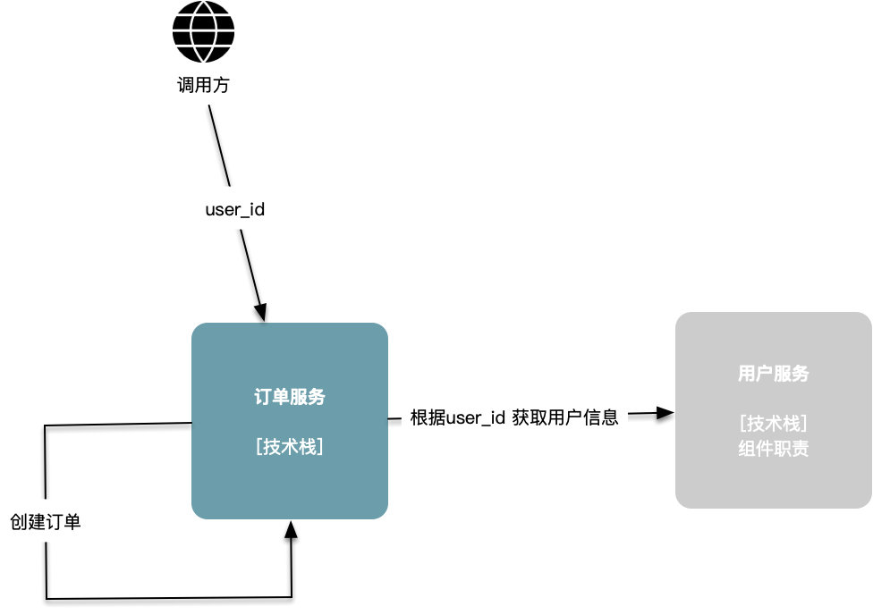
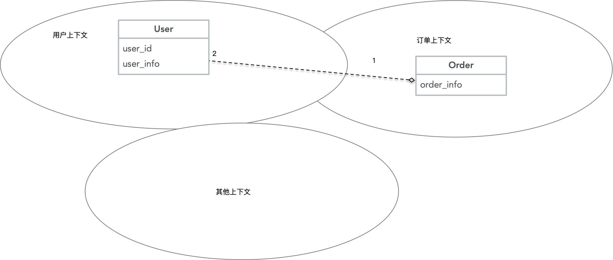
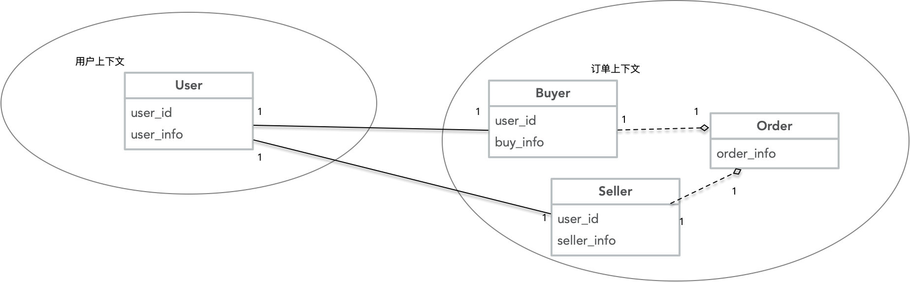
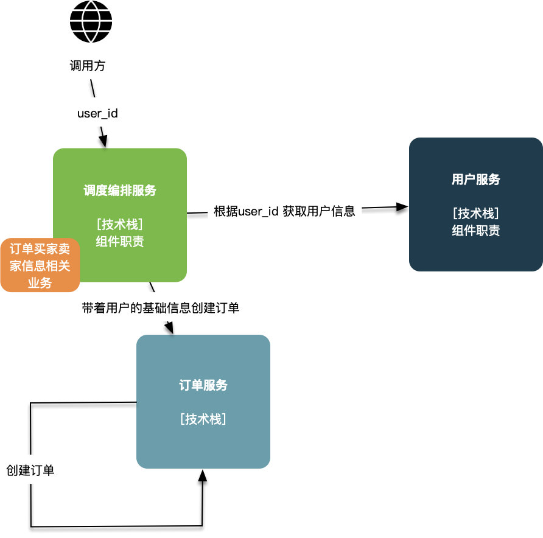
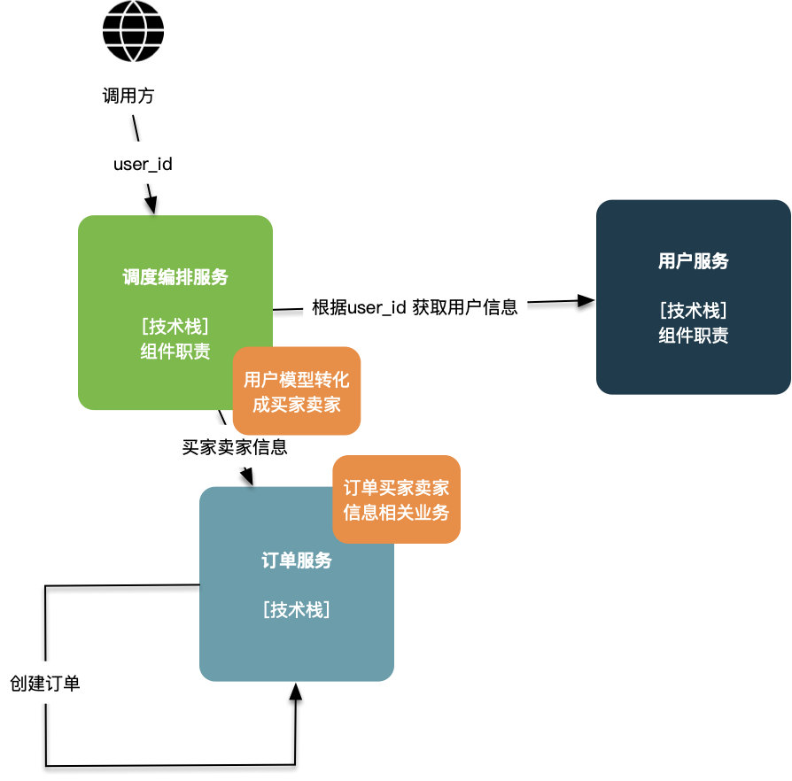

## 01 问题背景

在一个群里看到这样一个问题问题：

> 说到接口设计，比如订单服务提供了【创建订单】接口，它会冗余用户的基本信息：手机号、昵称、性别之类的。作为调用他的服务我觉得只要传递user_id就可以了，要什么信息订单服务去调用用户服务获取。
> 不然每个服务调用订单创建接口都要去拿到用户信息再传递过去。不知道大家怎么看？

这是个很有意思的问题，题目中隐含的两种设计是把用户基本信息作为参数传递和订单服务自己获取用户信息。

方案1 传递用户id

方案2 传递用户信息

## 02 不能尽善尽美的两种方案

### 突出易用性但会导致级联修改的方案1

方案1 突出了易用性，对于订单服务的使用者不需要调用用户服务，只要提供最小的信息，由订单服务自己组织数据，这是这个方案的收益。

相应导致的后果就是霰弹式修改，比如用户服务中的用户模型进行了一些修改，比如用户的地址由一个String 改为一个Address类，必然需要检查所有的依赖，对于订单服务必然需要进行修改。往往在整体架构中，订单服务是处于比较核心且基础的部分，如果发现这些改进方案会影响到订单服务，那这些优化改进往往不了了之。

### 突出服务的"纯洁"性的方案2

方案2突出了服务的"纯洁"性，订单服务不依赖用户服务，两者都服从调度编排服务的安排。听上去有效的规避了方案1中订单服务与用户服务过度耦合的问题。

但按照这个方案实施代码，实际上是把方案1中的订单服务中的 `业务逻辑` 部分上升到调度编排服务，调度编排服务就慢慢的向ESB的方向发展，变成了集成各个微服务，对外提供新能力的中间件，更可怕的是订单服务变成了单纯的单表服务，更像一个订单数据库提供了一个http协议的接口。然后一个分布式单体系统就这么做出来了。

## 03 最严重的问题是认知负载问题

先来定义一下团队规模，如果是十几个服务三五个人负责开发，那么推荐的方案就是方案0，别拆微服务了用单体即可。假设不存在过度设计问题，既然是划分服务了，那么必然是多个团队共同协作，每个团队负责一两个服务这样子。

无论是方案1还是方案2，都无法回避的一个问题就是不管是订单服务、编排服务还是前端，用户这个模型是个一以贯之的概念，所有开发都需要了解这个用户模型，做跟用户相关的修改还是做牵扯到的业务，用户这个模型的内容和结构都是需要考虑的，比如订单里面的收货地址和用户的家庭住址之间的关联。

人的认识能力是有限的，美国心理学家George A. Miller在论文《The magical number seven, plus or minus two: Some limits on our capacity for processing information》中提到，人大脑的缓存大概是7件事，比较舒适的处理能力是5，当然现代人脑科学的发展对这个数字有更精确的描述。然后用户这个概念在整个项目组里都在常驻内存里，就像开机启动了个某某卫士，对整个团队实际的效率必然会产生影响。

> ieee一个白皮书里写的，软件是人类至今为止发明的最复杂的产物，但很多人都忽略了这种复杂性很容易就超出自己的掌控范围，误以为自己把握的住。----一位前辈大佬

## 04 解决思路：限界上下文与上下文

> 限界上下文强调概念的一致性。虽然传统的方法学已经在追求概念的一致性，但是忽略了系统的庞大性，不论系统多庞大，在系统任何位置同一概念通用。DDD 不追求全局的一致性，而是将系统拆成多块，在相同的上下文中实现概念一致性。  -----https://domain-driven-design.org

那么在订单这个上下文下，有用户这个概念么？好像有，但是更精确的描述是`买家` 和`卖家` 。是的，订单服务只有**买家**和**卖家**，并没有用户。

那么订单服务必须没有用户，但必须涵盖`买家` 和`卖家`的概念，对应的模型改进示意图如下：

 分布式单体的建模

限界上下文

## 05 解决方案: 角色扮演

履约建模中有个重要的概念叫做扮演，类似的概念在分析模式中被称为抽象和泛化，相较而言，我更喜欢扮演这个隐喻，看上去更拟人化，更容易掌握，在履约建模中有常见的扮演场景有： 当事人角色化、领域逻辑角色化、三方系统角色化、相关上下文角色化以及凭证角色化；角色化或者扮演是系统的边界和扩展点。

这个场景很明显是当事人角色化，就是系统用户扮演的买家和系统用户扮演的卖家签订的合同，称之为订单：

履约建模

因为扮演是个一对多的关系，注册用户可以扮演顾客，那未来对接微信渠道的时候，微信用户也可以扮演顾客，这个时候，我们的系统提供的不是一种业务场景，而是一种业务能力，对应的技术实现可能是如下所示的：

方案2 传递用户信息

方案3 买家卖家

## 06 反思：微服务的一个服务是什么

反思这个问题，我们会发现一个很典型的问题：微服务的一个服务到底指代的是什么？对于订单这个概念是对于订单这个服务的增删查改么？不是，我们要的是业务能力。

> The microservice approach to division is different, splitting up into services organized around **business capability**. ---- Martin Fowler 

我们的微服务是将整个系统的业务能力拆解为一个个独立的业务能力，然后由独立的团队负责开发和运营，然后对大的业务能力进行支撑，基于微服务的应用比如说电商这种，它依赖的不应该是订单服务的业务功能，而是可以下单的这个业务能力。那如何描述这个业务能力呢？在思考订单服务的时候，把订单服务当做类似支付宝支付这样的基础设施去思考，它应该怎么定义自己的api用以提供自己的业务能力，类似创建订单这个场景，就像支付宝支付的API，因为，其实对于其他使订单服务的业务能力的人来说，调用订单服务跟调用支付宝服务除了认证相关的内容，好像也没有什么不同。

编者注：履约建模中扮演和《建模方法元模型》中的 Play 建模法类似，都是将代码中的对象比喻为现实中的事物，这种比喻刚好符合主客体的认知模式。

